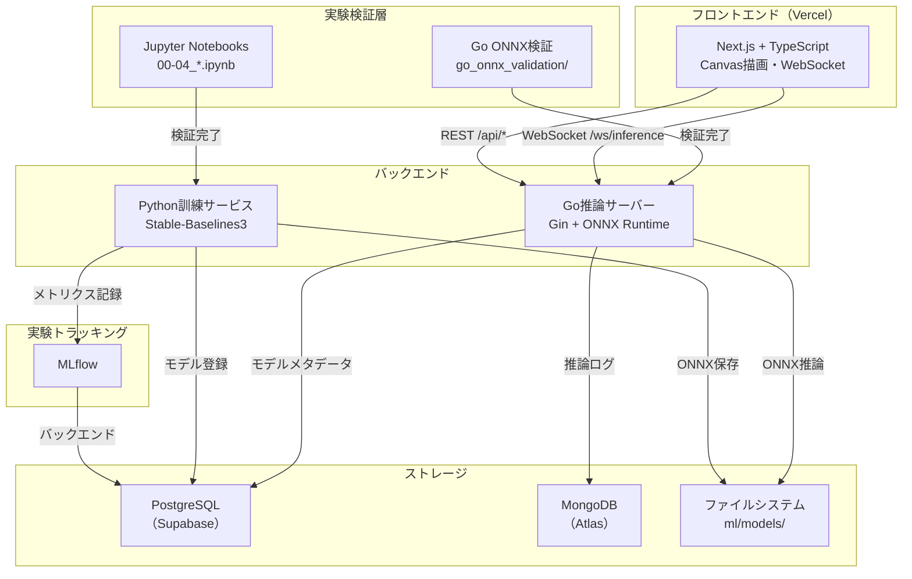
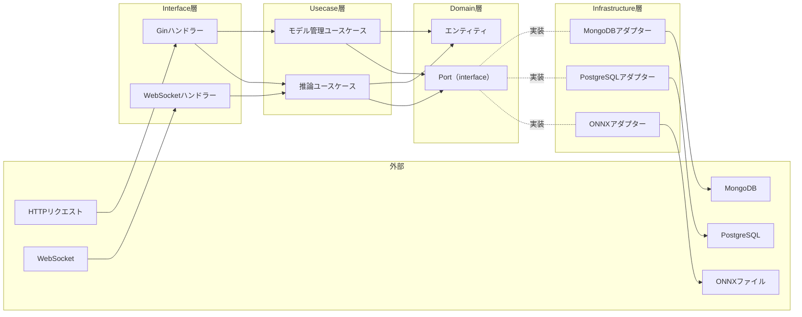

# 設計書

## 概要

RL Maze Phase 1は、強化学習エージェントの迷路探索をリアルタイムで可視化するシステムである。本設計は、実験検証から本番運用までのエンドツーエンドフローを確立し、クリーンアーキテクチャ・型安全性・観測可能性・将来のクラウド移行を前提とした設計判断を含む。

システムは以下の主要コンポーネントで構成される：

1. **実験検証層（Jupyter Notebook）**: RLアルゴリズムとONNX変換の事前検証
2. **迷路環境（Python）**: Gym互換の10×10迷路環境（部分観測5×5）
3. **訓練サービス（Python + Stable-Baselines3）**: PPO/DQN訓練・MLflow記録・ONNX自動変換
4. **推論サーバー（Go + Gin）**: クリーンアーキテクチャ・ONNX推論・WebSocket/REST API
5. **フロントエンドUI（Next.js + TypeScript）**: Canvas描画・リアルタイム可視化・WebSocket受信

## アーキテクチャ

### システム構成図



### クリーンアーキテクチャ（Go推論サーバー）

Go推論サーバーはクリーンアーキテクチャを採用し、依存関係を常にドメイン層に向ける。これにより将来のAWS移行時にインフラ層のみを差し替えることが可能になる。



**依存関係ルール:**
- Domain層: 外部依存なし（Portインターフェースのみ定義）
- Usecase層: Domain層のPortのみに依存
- Interface層: Usecase層に依存
- Infrastructure層: Domain層のPortを実装

## コンポーネントとインターフェース

### 1. 実験検証層（Jupyter Notebook）

**目的**: 本実装前にRLアルゴリズム・ONNX変換・Go統合を検証し、技術リスクを早期に特定する。

**コンポーネント:**

| Notebook | 責務 | 出力 |
|----------|------|------|
| `00_rl_basic.ipynb` | RL導入・ランダムvs訓練済みエージェント比較 | アニメーション・学習曲線 |
| `01_dqn_basic.ipynb` | DQN基礎実装・CartPole訓練 | 学習曲線・訓練済みモデル |
| `02_ppo_basic.ipynb` | PPO基礎実装・CartPole訓練 | 学習曲線・訓練済みモデル |
| `03_maze_env.ipynb` | 迷路環境実装・報酬設計検証 | 環境動作確認・報酬分布 |
| `04_onnx_export.ipynb` | ONNX変換・入出力シェイプ検証 | ONNXファイル・シェイプ情報 |
| `go_onnx_validation/` | Go-ONNX統合検証 | 推論結果・レイテンシ計測 |

**インターフェース:**
- 入力: なし（手動実行）
- 出力: 検証結果・学習済みモデル・ONNXファイル

### 2. 迷路環境（Python）

**目的**: Gym互換の迷路環境を提供し、部分観測の下でRLエージェントを訓練可能にする。

**クラス設計:**

```python
class MazeEnv(gym.Env):
    """
    10×10迷路環境（部分観測5×5）
    """
    def __init__(self, maze_config: dict):
        self.grid_size = 10
        self.observation_size = 5
        self.action_space = gym.spaces.Discrete(4)  # 上下左右
        self.observation_space = gym.spaces.Box(
            low=0, high=1, shape=(25,), dtype=np.float32
        )
        self.max_steps = 200
        self._load_maze(maze_config)
    
    def reset(self) -> np.ndarray:
        """エージェントをスタート位置に配置し、初期観測を返す"""
        pass
    
    def step(self, action: int) -> Tuple[np.ndarray, float, bool, dict]:
        """行動を実行し、観測・報酬・終了フラグ・情報を返す"""
        pass
    
    def _get_partial_observation(self) -> np.ndarray:
        """エージェント周囲5×5の部分観測を取得"""
        pass
    
    def _calculate_reward(self, action: int, new_pos: Tuple[int, int]) -> float:
        """報酬を計算（ゴール+1.0、ステップ-0.01、壁衝突-0.05）"""
        pass
```

**報酬設計:**
- ゴール到達: +1.0
- 毎ステップ: -0.01（最短経路を促す）
- 壁衝突: -0.05（無効行動の抑制）

**インターフェース:**
- `reset() -> observation: np.ndarray[25]`
- `step(action: int) -> (observation, reward, done, info)`
- `render() -> None`（デバッグ用）

### 3. 訓練サービス（Python）

**目的**: PPO/DQNアルゴリズムでエージェントを訓練し、MLflowにメトリクスを記録し、ONNX形式に自動変換する。

**クラス設計:**

```python
class TrainingService:
    """
    RL訓練パイプライン
    """
    def __init__(self, config: TrainingConfig):
        self.config = config
        self.env = MazeEnv(config.maze_config)
        self.mlflow_client = mlflow.tracking.MlflowClient()
    
    def train(self, algorithm: str) -> str:
        """
        訓練を実行し、モデルIDを返す
        
        Args:
            algorithm: "PPO" or "DQN"
        
        Returns:
            model_id: 登録されたモデルのID
        """
        experiment_id = self._create_experiment()
        
        if algorithm == "PPO":
            model = PPO("MlpPolicy", self.env, verbose=1)
        elif algorithm == "DQN":
            model = DQN("MlpPolicy", self.env, verbose=1)
        
        # 訓練ループ
        for episode in range(self.config.total_episodes):
            model.learn(total_timesteps=self.config.timesteps_per_episode)
            metrics = self._evaluate(model)
            self._log_metrics(experiment_id, episode, metrics)
        
        # ONNX変換
        onnx_path = self._convert_to_onnx(model)
        
        # モデル登録
        model_id = self._register_model(algorithm, onnx_path, metrics)
        
        return model_id
    
    def _convert_to_onnx(self, model) -> str:
        """Stable-Baselines3モデルをONNXに変換"""
        pass
    
    def _register_model(self, algorithm: str, onnx_path: str, metrics: dict) -> str:
        """モデルメタデータをPostgreSQLに登録"""
        pass
```

**MLflowメトリクス:**
- `episode_reward`: エピソードごとの累積報酬
- `episode_length`: エピソードごとのステップ数
- `loss`: 損失関数の値
- `success_rate`: 10エピソードごとの成功率

**インターフェース:**
- REST API: `POST /training/start` (algorithm, config) → 訓練を開始し、experiment_idを返す
- REST API: `GET /training/status/{experiment_id}` → 訓練ステータスを返す
- REST API: `POST /training/stop/{experiment_id}` → 訓練を停止
- WebSocket: `/ws/training/{experiment_id}` → 訓練進捗をリアルタイム配信（10秒ごと）
- REST API: `GET /experiments` → MLflowから実験一覧を取得
- REST API: `GET /experiments/{experiment_id}` → MLflowから実験詳細を取得

**WebSocket進捗メッセージ形式:**
```json
{
  "experiment_id": "uuid",
  "episode": 50,
  "total_episodes": 1000,
  "reward": 0.8,
  "loss": 0.02,
  "success_rate": 0.65,
  "reward_history": [0.1, 0.3, 0.5, 0.8],
  "success_rate_history": [0.2, 0.4, 0.5, 0.65],
  "timestamp": 1708598400
}
```

**MLflow統合:**
- MLflow Tracking APIを使用して実験一覧・詳細を取得
- 実験一覧: `experiment_id`, `algorithm`, `started_at`, `success_rate`, `total_episodes`
- 実験詳細: 上記に加えて `metrics.episode_rewards`, `metrics.losses`, `metrics.success_rates`

### 4. 推論サーバー（Go）

**目的**: クリーンアーキテクチャでONNX推論を提供し、低レイテンシ（p95 < 50ms）とAWS移行能力を確保する。

**ディレクトリ構成:**

```
backend/inference/
├── cmd/
│   └── main.go                   # エントリーポイント・DIコンテナ初期化
├── internal/
│   ├── domain/                   # ドメイン層
│   │   ├── model.go              # モデルエンティティ
│   │   ├── inference.go          # 推論エンティティ
│   │   └── port.go               # Portインターフェース定義
│   ├── usecase/                  # ユースケース層
│   │   ├── inference_usecase.go  # 推論実行ユースケース
│   │   └── model_usecase.go      # モデル管理ユースケース
│   ├── interface/                # インターフェース層
│   │   ├── handler/
│   │   │   ├── health.go         # ヘルスチェック
│   │   │   ├── model.go          # モデル管理API
│   │   │   └── middleware.go     # ログ・エラーハンドリング
│   │   └── websocket/
│   │       └── inference.go      # 推論WebSocketハンドラー
│   └── infrastructure/           # インフラ層
│       ├── onnx/
│       │   └── runtime.go        # ONNXランタイムアダプター
│       ├── postgres/
│       │   └── repository.go     # PostgreSQLアダプター
│       └── mongodb/
│           └── logger.go         # MongoDBロガーアダプター
└── di/
    └── wire.go                   # google/wire DIコンテナ定義
```

**Domain層（Port定義）:**

```go
package domain

// Model エンティティ
type Model struct {
    ID          string
    Algorithm   string
    TrainedAt   time.Time
    SuccessRate float64
    ONNXPath    string
}

// InferenceResult エンティティ
type InferenceResult struct {
    Action   int
    QValues  []float64
    Duration time.Duration
}

// ModelRepository Port
type ModelRepository interface {
    FindAll(ctx context.Context) ([]Model, error)
    FindByID(ctx context.Context, id string) (*Model, error)
    GetActive(ctx context.Context) (*Model, error)
    SetActive(ctx context.Context, id string) error
}

// InferenceEngine Port
type InferenceEngine interface {
    LoadModel(ctx context.Context, modelPath string) error
    Predict(ctx context.Context, observation []float32) (*InferenceResult, error)
}

// InferenceLogger Port
type InferenceLogger interface {
    LogInference(ctx context.Context, modelID string, result *InferenceResult) error
    LogError(ctx context.Context, err error) error
}
```

**Usecase層:**

```go
package usecase

type InferenceUsecase struct {
    engine InferenceEngine
    logger InferenceLogger
    modelRepo ModelRepository
}

func (u *InferenceUsecase) ExecuteInference(ctx context.Context, observation []float32) (*InferenceResult, error) {
    // 推論実行
    result, err := u.engine.Predict(ctx, observation)
    if err != nil {
        u.logger.LogError(ctx, err)
        return nil, err
    }
    
    // ログ記録
    activeModel, _ := u.modelRepo.GetActive(ctx)
    u.logger.LogInference(ctx, activeModel.ID, result)
    
    return result, nil
}
```

**Infrastructure層（Adapter実装）:**

```go
package onnx

type ONNXRuntime struct {
    session *onnxruntime.Session
}

func (r *ONNXRuntime) LoadModel(ctx context.Context, modelPath string) error {
    // ONNX Runtimeでモデルをロード
}

func (r *ONNXRuntime) Predict(ctx context.Context, observation []float32) (*domain.InferenceResult, error) {
    // 推論実行・レイテンシ計測
    start := time.Now()
    // ... ONNX推論処理 ...
    duration := time.Since(start)
    
    return &domain.InferenceResult{
        Action:   action,
        QValues:  qValues,
        Duration: duration,
    }, nil
}
```

**REST APIエンドポイント:**

| メソッド | パス | 説明 | レスポンス |
|---------|------|------|-----------|
| GET | `/health` | ヘルスチェック | `{"status": "healthy"}` |
| GET | `/api/models` | モデル一覧取得 | `[{id, algorithm, success_rate, ...}]` |
| GET | `/api/models/:id` | モデル詳細取得 | `{id, algorithm, trained_at, ...}` |
| POST | `/api/models/active` | アクティブモデル切り替え | `{id, message}` |

**WebSocketエンドポイント:**

| パス | 説明 | メッセージ形式 |
|------|------|---------------|
| `/ws/inference` | 推論ストリーミング | `{position: [x,y], q_values: [...], step: int, reward: float}` |

### 5. フロントエンドUI（Next.js）

**目的**: エージェントの振る舞いをリアルタイムで可視化し、意思決定プロセスを観察可能にする。

**ディレクトリ構成:**

```
frontend/
├── src/
│   ├── app/
│   │   ├── page.tsx              # 推論UI（メインページ）
│   │   ├── layout.tsx            # レイアウト
│   │   └── api/                  # API Routes（Goサーバーへのプロキシ）
│   │       ├── models/route.ts
│   │       └── health/route.ts
│   ├── components/
│   │   ├── MazeCanvas.tsx        # Canvas描画コンポーネント
│   │   ├── PlaybackControls.tsx # 再生コントロール
│   │   ├── MetricsPanel.tsx      # メトリクス表示
│   │   ├── RewardGraph.tsx       # 累積報酬グラフ
│   │   └── ConnectionStatus.tsx # WebSocket接続ステータス
│   ├── hooks/
│   │   ├── useWebSocket.ts       # WebSocket管理フック
│   │   └── useInference.ts       # 推論状態管理フック
│   └── types/
│       └── inference.ts          # 型定義
├── package.json
└── tsconfig.json
```

**主要コンポーネント:**

**MazeCanvas.tsx:**
```typescript
interface MazeCanvasProps {
  maze: number[][];
  agentPosition: [number, number];
  qValues: number[][];
  visitedCells: Set<string>;
}

export function MazeCanvas({ maze, agentPosition, qValues, visitedCells }: MazeCanvasProps) {
  const canvasRef = useRef<HTMLCanvasElement>(null);
  
  useEffect(() => {
    const canvas = canvasRef.current;
    if (!canvas) return;
    
    const ctx = canvas.getContext('2d');
    if (!ctx) return;
    
    // 迷路グリッド描画
    drawMaze(ctx, maze);
    
    // 訪問済みセルハイライト
    drawVisitedCells(ctx, visitedCells);
    
    // Q値方向矢印
    drawQValueArrows(ctx, qValues);
    
    // エージェント位置
    drawAgent(ctx, agentPosition);
  }, [maze, agentPosition, qValues, visitedCells]);
  
  return <canvas ref={canvasRef} width={500} height={500} />;
}
```

**useWebSocket.ts:**
```typescript
export function useWebSocket(url: string) {
  const [status, setStatus] = useState<'connected' | 'disconnected' | 'reconnecting'>('disconnected');
  const [data, setData] = useState<InferenceData | null>(null);
  const wsRef = useRef<WebSocket | null>(null);
  
  useEffect(() => {
    const connect = () => {
      const ws = new WebSocket(url);
      
      ws.onopen = () => setStatus('connected');
      ws.onclose = () => {
        setStatus('disconnected');
        // 5秒後に自動再接続
        setTimeout(connect, 5000);
      };
      ws.onmessage = (event) => {
        const inferenceData = JSON.parse(event.data);
        setData(inferenceData);
      };
      
      wsRef.current = ws;
    };
    
    connect();
    
    return () => wsRef.current?.close();
  }, [url]);
  
  return { status, data, send: (msg: string) => wsRef.current?.send(msg) };
}
```

**UI構成:**

| エリア | コンポーネント | 機能 |
|--------|---------------|------|
| 左メイン | MazeCanvas | 迷路グリッド・エージェント・Q値矢印・訪問済みセル |
| 右上 | PlaybackControls | Play/Stop/Reset・速度スライダー・ステップ表示 |
| 右下 | MetricsPanel | Steps・Reward・Action・Max Q |
| 左下 | RewardGraph | 累積報酬のリアルタイムグラフ |
| ヘッダー右 | ConnectionStatus | WebSocket接続ステータス |

### データフェッチング戦略（useSWR）

**使用ライブラリ:** `swr`

**方針:**
- REST APIからのデータ取得には`useSWR`を使用
- キャッシュ・再検証・エラーハンドリングを統一的に管理
- WebSocketはリアルタイム性が必要なため`useSWR`を使用しない

**実装例:**

```typescript
import useSWR from 'swr';

// Fetcher関数（全体で共有）
const fetcher = async (url: string) => {
  const res = await fetch(url);
  
  if (!res.ok) {
    const error = new Error('An error occurred while fetching the data.');
    error.info = await res.json();
    error.status = res.status;
    throw error;
  }
  
  return res.json();
};

// モデル一覧取得
function useModels() {
  const { data, error, isLoading, mutate } = useSWR<Model[]>(
    '/api/models',
    fetcher,
    {
      refreshInterval: 30000, // 30秒ごとに再検証
      revalidateOnFocus: true, // フォーカス時に再検証
    }
  );
  
  return {
    models: data,
    isLoading,
    isError: error,
    mutate, // 手動再検証用
  };
}

// アクティブモデル取得
function useActiveModel() {
  const { data, error, isLoading } = useSWR<Model>(
    '/api/models/active',
    fetcher,
    {
      refreshInterval: 10000, // 10秒ごとに再検証
    }
  );
  
  return {
    activeModel: data,
    isLoading,
    isError: error,
  };
}

// モデル切り替え（Mutationパターン）
async function setActiveModel(modelId: string, mutate: KeyedMutator<Model>) {
  try {
    // 楽観的更新（即座にUIを更新）
    mutate(
      async (currentData) => {
        // API呼び出し
        const res = await fetch('/api/models/active', {
          method: 'POST',
          headers: { 'Content-Type': 'application/json' },
          body: JSON.stringify({ model_id: modelId }),
        });
        
        if (!res.ok) {
          throw new Error('Failed to set active model');
        }
        
        return res.json();
      },
      {
        optimisticData: { id: modelId } as Model, // 楽観的更新データ
        rollbackOnError: true, // エラー時にロールバック
        populateCache: true, // キャッシュを更新
        revalidate: false, // 即座に再検証しない
      }
    );
  } catch (error) {
    console.error('Failed to set active model:', error);
    toast.error('Failed to switch model');
  }
}

// コンポーネントでの使用例
function ModelSelector() {
  const { models, isLoading, isError } = useModels();
  const { activeModel } = useActiveModel();
  const { mutate } = useSWR('/api/models/active');
  
  if (isError) return <div>Failed to load models</div>;
  if (isLoading) return <div>Loading...</div>;
  
  return (
    <select
      value={activeModel?.id}
      onChange={(e) => setActiveModel(e.target.value, mutate)}
    >
      {models?.map((model) => (
        <option key={model.id} value={model.id}>
          {model.algorithm} - {model.success_rate}%
        </option>
      ))}
    </select>
  );
}

// ヘルスチェック（定期的な監視）
function useHealthCheck() {
  const { data, error } = useSWR<{ status: string }>(
    '/api/health',
    fetcher,
    {
      refreshInterval: 5000, // 5秒ごとにヘルスチェック
      shouldRetryOnError: true,
      errorRetryCount: 3,
    }
  );
  
  return {
    isHealthy: data?.status === 'healthy',
    isError: error,
  };
}
```

**useSWRの利点:**
- 自動キャッシュ: 同じデータを複数コンポーネントで共有
- 自動再検証: フォーカス時・定期的に最新データを取得
- エラーハンドリング: 統一的なエラー処理
- 楽観的更新: UI応答性の向上
- TypeScript対応: 型安全なデータフェッチング

**WebSocketとの使い分け:**
- REST API（モデル一覧・ヘルスチェック等）: `useSWR`
- WebSocket（推論ストリーミング）: カスタムフック（`useWebSocket`）

## データモデル

### PostgreSQL スキーマ

**modelsテーブル:**
```sql
CREATE TABLE models (
    id UUID PRIMARY KEY DEFAULT gen_random_uuid(),
    algorithm VARCHAR(10) NOT NULL,  -- 'PPO' or 'DQN'
    trained_at TIMESTAMP NOT NULL DEFAULT NOW(),
    success_rate FLOAT NOT NULL,
    onnx_path VARCHAR(255) NOT NULL,
    created_at TIMESTAMP NOT NULL DEFAULT NOW()
);

CREATE INDEX idx_models_trained_at ON models(trained_at DESC);
```

**active_modelテーブル:**
```sql
CREATE TABLE active_model (
    id SERIAL PRIMARY KEY,
    model_id UUID NOT NULL REFERENCES models(id),
    updated_at TIMESTAMP NOT NULL DEFAULT NOW()
);
```

### MongoDB スキーマ

**inference_logsコレクション:**
```json
{
  "_id": ObjectId,
  "timestamp": ISODate,
  "request_id": "uuid",
  "model_id": "uuid",
  "maze_id": "string",
  "observation": [float],
  "action": int,
  "q_values": [float],
  "duration_ms": float,
  "success": boolean,
  "total_reward": float
}
```

**error_logsコレクション:**
```json
{
  "_id": ObjectId,
  "timestamp": ISODate,
  "level": "error",
  "message": "string",
  "stack_trace": "string",
  "context": {
    "request_id": "uuid",
    "model_id": "uuid"
  }
}
```

### WebSocket メッセージスキーマ

**推論データ（サーバー → クライアント）:**
```typescript
interface InferenceData {
  position: [number, number];
  q_values: number[];
  step: number;
  reward: number;
  cumulative_reward: number;
  action: number;
  done: boolean;
  server_ts: number;  // レイテンシ計測用
}
```

**制御メッセージ（クライアント → サーバー）:**
```typescript
interface ControlMessage {
  command: 'start' | 'stop' | 'reset';
  speed?: number;  // 1-10（推論頻度）
}
```

## 正確性プロパティ

*プロパティとは、システムの全ての有効な実行において真であるべき特性や振る舞いである。プロパティは人間が読める仕様と機械で検証可能な正確性保証の橋渡しとなる。*

### 迷路環境プロパティ

**プロパティ1: 迷路初期化の完全性**
*任意の* 迷路設定に対して、初期化後のグリッドは壁・通路・スタート位置・ゴール位置の全てを含まなければならない
**検証: 要件 2.1**

**プロパティ2: 観測ベクトルの形状不変性**
*任意の* 迷路環境とエージェント位置に対して、reset()およびstep()が返す観測ベクトルは常に25次元でなければならない
**検証: 要件 2.2, 2.3**

**プロパティ3: ゴール到達時の報酬一貫性**
*任意の* 迷路環境において、エージェントがゴール位置に到達したとき、報酬は+1.0でありdone=Trueでなければならない
**検証: 要件 2.4**

**プロパティ4: 通常ステップの報酬一貫性**
*任意の* 迷路環境において、エージェントがゴールに到達せず壁にも衝突しないステップでは、報酬は-0.01でなければならない
**検証: 要件 2.5**

**プロパティ5: 壁衝突時の不変性**
*任意の* 迷路環境において、エージェントが壁に移動しようとしたとき、報酬は-0.05であり、エージェント位置は変化してはならない
**検証: 要件 2.6**

**プロパティ6: 最大ステップ超過時の終了**
*任意の* 迷路環境において、エージェントが200ステップを超えたとき、done=Trueでなければならない
**検証: 要件 2.7**

**プロパティ7: 行動空間の一貫性**
*任意の* 迷路環境において、action_spaceはDiscrete(4)でなければならない
**検証: 要件 2.8**

**プロパティ8: 観測空間の一貫性**
*任意の* 迷路環境において、observation_spaceはBox(shape=(25,))でなければならない
**検証: 要件 2.9**

### 訓練サービスプロパティ

**プロパティ9: MLflowメトリクス記録の完全性**
*任意の* 訓練エピソードに対して、システムはエピソード報酬・エピソード長・損失値をMLflowに記録しなければならない。さらに、10エピソードごとに成功率を記録しなければならない
**検証: 要件 3.3, 3.4, 3.5, 3.6**

**プロパティ10: ONNX変換の自動実行**
*任意の* 訓練完了時に、システムは訓練済みモデルを自動的にONNX形式に変換し、`ml/models/`ディレクトリに保存しなければならない
**検証: 要件 3.8, 3.9**

**プロパティ11: モデルメタデータの完全性**
*任意の* 訓練完了時に、システムはアルゴリズム・訓練日時・成功率・ONNXファイルパスを含むモデルメタデータをPostgreSQLに登録しなければならない
**検証: 要件 3.10**

### 推論サーバープロパティ

**プロパティ12: 推論レイテンシの上限**
*任意の* 観測ベクトルに対して、ONNX推論は50ms以内（p95）に行動とQ値を返さなければならない
**検証: 要件 4.2**

**プロパティ13: モデル一覧取得の完全性**
*任意の* モデルデータセットに対して、`GET /api/models`はPostgreSQLに登録された全てのモデルを返さなければならない
**検証: 要件 4.4**

**プロパティ14: アクティブモデル切り替えの一貫性**
*任意の* 有効なmodel_idに対して、`POST /api/models/active`はPostgreSQLのアクティブモデル参照を更新し、その後の`GET /api/models/active`は更新されたモデルを返さなければならない
**検証: 要件 4.5**

**プロパティ15: WebSocket推論ストリーミングの継続性**
*任意の* WebSocket接続に対して、システムは接続が確立されている間、推論結果を継続的にストリーミングしなければならない
**検証: 要件 4.6**

**プロパティ16: 推論ログの完全性**
*任意の* 推論実行に対して、システムはrequest_id・duration_ms・model_idを含むJSON形式のログをMongoDBに記録しなければならない
**検証: 要件 4.7**

**プロパティ17: エラーログの完全性**
*任意の* エラー発生時に、システムはtimestamp・level・エラーメッセージ・スタックトレースを含むJSON形式のログをMongoDBに記録しなければならない
**検証: 要件 4.8**

**プロパティ18: ドメイン層の外部依存禁止**
*全ての* ドメイン層のコードは、外部依存（データベース・ONNX・HTTPフレームワーク）をインポートしてはならない
**検証: 要件 4.9**

**プロパティ19: ユースケース層の依存制約**
*全ての* ユースケース層のコードは、ドメイン層のPortインターフェースのみに依存しなければならない
**検証: 要件 4.10**

**プロパティ20: インフラ層のPort実装**
*全ての* インフラ層のアダプターは、ドメイン層のPortインターフェースを実装しなければならない
**検証: 要件 4.11**

### フロントエンドUIプロパティ

**プロパティ21: WebSocket切断時の自動再接続**
*任意の* WebSocket切断イベントに対して、フロントエンドUIは自動的に再接続を試み、ステータスを"Disconnected"から"Reconnecting"に更新しなければならない
**検証: 要件 5.3**

**プロパティ22: UI更新レイテンシの上限**
*任意の* 推論データ受信に対して、Canvas上のエージェント位置は200ms以内に更新されなければならない
**検証: 要件 5.4**

**プロパティ23: Q値矢印表示の完全性**
*任意の* 推論データに対して、システムは各セルにQ値最大方向の矢印を表示しなければならない
**検証: 要件 5.5**

**プロパティ24: 訪問済みセルハイライトの一貫性**
*任意の* 訪問履歴に対して、システムは訪問済みセルを色分けしてハイライト表示しなければならない
**検証: 要件 5.6**

**プロパティ25: 速度スライダーの応答性**
*任意の* 速度値（1-10）に対して、推論リクエスト頻度はスライダー値に比例して変化しなければならない
**検証: 要件 5.10**

**プロパティ26: メトリクス表示の完全性**
*任意の* 推論データに対して、メトリクスタブは現在のステップ数・報酬・行動・最大Q値を表示しなければならない
**検証: 要件 5.11**

**プロパティ27: 累積報酬グラフのリアルタイム更新**
*任意の* 報酬履歴に対して、累積報酬グラフはエージェントの進行に合わせてリアルタイムで更新されなければならない
**検証: 要件 5.12**

### ログ・トラッキングプロパティ

**プロパティ28: 構造化ログの形式一貫性**
*任意の* リクエスト処理に対して、システムはtimestamp・level・request_id・duration_msを含む構造化JSONログを出力しなければならない
**検証: 要件 6.1**

**プロパティ29: エラーログの形式一貫性**
*任意の* エラー発生に対して、システムはtimestamp・level・エラーメッセージ・スタックトレースを含む構造化JSONログを出力しなければならない
**検証: 要件 6.2**

**プロパティ30: MLflow実験IDの一意性**
*任意の* 実験開始に対して、システムは一意のexperiment_idを持つ新しいMLflow実験を作成しなければならない
**検証: 要件 6.3**

**プロパティ31: MLflowメトリクス送信の完全性**
*任意の* メトリクス記録に対して、システムはエピソード報酬・エピソード長・損失・成功率をMLflowに送信しなければならない
**検証: 要件 6.4**

**プロパティ32: MLflowモデル登録の完全性**
*任意の* 訓練完了に対して、システムは最終モデルをメタデータ（アルゴリズム・訓練日時・成功率）と共にMLflowに登録しなければならない
**検証: 要件 6.5**

**プロパティ33: MLflowバックエンドストレージの永続化**
*任意の* MLflowメトリクス受信に対して、システムはデータをPostgreSQLバックエンドストレージに永続化しなければならない
**検証: 要件 6.6**

### 設定管理プロパティ

**プロパティ34: 環境変数欠落時のFail Fast**
*任意の* 必須環境変数（DATABASE_URL, MONGODB_URI, MLFLOW_TRACKING_URI, NEXT_PUBLIC_WS_URL）が欠落しているとき、システムはどの変数が必要かを示す明確なエラーメッセージと共に即座に失敗しなければならない
**検証: 要件 7.6**

### ディレクトリ構造プロパティ

**プロパティ35: READMEの完全性**
*任意の* サービスディレクトリ（experiments, frontend, backend/inference, backend/training）に対して、READMEはセットアップ手順・環境変数・クイックスタートコマンドを提供しなければならない
**検証: 要件 8.6**

## バリデーション戦略

### バリデーション方針

システムは多層防御アプローチを採用し、各レイヤーでバリデーションを実施する：

1. **フロントエンド（TypeScript + Zod）**: ユーザー入力とAPI送信前のバリデーション
2. **API境界（Go）**: REST API・WebSocketメッセージの受信時バリデーション
3. **ドメイン層（Go）**: ビジネスルールのバリデーション

### フロントエンドバリデーション（TypeScript + Zod）

**使用ライブラリ:** `zod`

**WebSocketメッセージスキーマ:**

```typescript
import { z } from 'zod';

// 推論データスキーマ（サーバー → クライアント）
export const InferenceDataSchema = z.object({
  position: z.tuple([z.number().int().min(0).max(9), z.number().int().min(0).max(9)]),
  q_values: z.array(z.number()).length(4),
  step: z.number().int().min(0).max(200),
  reward: z.number(),
  cumulative_reward: z.number(),
  action: z.number().int().min(0).max(3),
  done: z.boolean(),
  server_ts: z.number().int().positive(),
});

export type InferenceData = z.infer<typeof InferenceDataSchema>;

// 制御メッセージスキーマ（クライアント → サーバー）
export const ControlMessageSchema = z.object({
  command: z.enum(['start', 'stop', 'reset']),
  speed: z.number().int().min(1).max(10).optional(),
});

export type ControlMessage = z.infer<typeof ControlMessageSchema>;

// モデル切り替えリクエストスキーマ
export const SetActiveModelRequestSchema = z.object({
  model_id: z.string().uuid(),
});

export type SetActiveModelRequest = z.infer<typeof SetActiveModelRequestSchema>;
```

**バリデーション実装例:**

```typescript
// WebSocket送信前のバリデーション
function sendControlMessage(ws: WebSocket, message: unknown) {
  try {
    // Zodでバリデーション
    const validatedMessage = ControlMessageSchema.parse(message);
    
    // バリデーション成功 → 送信
    ws.send(JSON.stringify(validatedMessage));
  } catch (error) {
    if (error instanceof z.ZodError) {
      console.error('Invalid control message:', error.errors);
      // ユーザーにエラー通知
      toast.error('Invalid command format');
    }
  }
}

// API POST前のバリデーション
async function setActiveModel(modelId: string) {
  try {
    // Zodでバリデーション
    const validatedRequest = SetActiveModelRequestSchema.parse({ model_id: modelId });
    
    // バリデーション成功 → API呼び出し
    const response = await fetch('/api/models/active', {
      method: 'POST',
      headers: { 'Content-Type': 'application/json' },
      body: JSON.stringify(validatedRequest),
    });
    
    if (!response.ok) {
      throw new Error('Failed to set active model');
    }
  } catch (error) {
    if (error instanceof z.ZodError) {
      console.error('Invalid model ID:', error.errors);
      toast.error('Invalid model ID format');
    }
  }
}

// WebSocket受信時のバリデーション
ws.onmessage = (event) => {
  try {
    const data = JSON.parse(event.data);
    
    // Zodでバリデーション
    const validatedData = InferenceDataSchema.parse(data);
    
    // バリデーション成功 → 状態更新
    setInferenceData(validatedData);
  } catch (error) {
    if (error instanceof z.ZodError) {
      console.error('Invalid inference data:', error.errors);
      // エラーログ記録・ユーザー通知
    }
  }
};
```

### Go APIバリデーション

**REST APIリクエストバリデーション:**

```go
package handler

import (
    "github.com/gin-gonic/gin"
    "github.com/go-playground/validator/v10"
)

// リクエストDTO
type SetActiveModelRequest struct {
    ModelID string `json:"model_id" binding:"required,uuid"`
}

type TrainingStartRequest struct {
    Algorithm string `json:"algorithm" binding:"required,oneof=PPO DQN"`
    Episodes  int    `json:"episodes" binding:"required,min=1,max=10000"`
}

// バリデーションミドルウェア
func ValidationMiddleware() gin.HandlerFunc {
    return func(c *gin.Context) {
        c.Next()
        
        // バリデーションエラーをキャッチ
        if len(c.Errors) > 0 {
            err := c.Errors.Last()
            
            if validationErrors, ok := err.Err.(validator.ValidationErrors); ok {
                // バリデーションエラーを整形
                errors := make(map[string]string)
                for _, e := range validationErrors {
                    errors[e.Field()] = formatValidationError(e)
                }
                
                c.JSON(400, gin.H{
                    "error": "Validation failed",
                    "details": errors,
                })
                c.Abort()
                return
            }
        }
    }
}

// ハンドラーでのバリデーション使用例
func (h *ModelHandler) SetActiveModel(c *gin.Context) {
    var req SetActiveModelRequest
    
    // Ginのバインディング機能でバリデーション
    if err := c.ShouldBindJSON(&req); err != nil {
        c.Error(err)
        return
    }
    
    // バリデーション成功 → ユースケース実行
    if err := h.modelUsecase.SetActive(c.Request.Context(), req.ModelID); err != nil {
        c.JSON(500, gin.H{"error": err.Error()})
        return
    }
    
    c.JSON(200, gin.H{"message": "Active model updated"})
}
```

**WebSocketメッセージバリデーション:**

```go
package websocket

import (
    "encoding/json"
    "github.com/gorilla/websocket"
)

type ControlMessage struct {
    Command string `json:"command" validate:"required,oneof=start stop reset"`
    Speed   *int   `json:"speed,omitempty" validate:"omitempty,min=1,max=10"`
}

func (h *InferenceHandler) HandleWebSocket(c *gin.Context) {
    conn, err := upgrader.Upgrade(c.Writer, c.Request, nil)
    if err != nil {
        return
    }
    defer conn.Close()
    
    for {
        _, message, err := conn.ReadMessage()
        if err != nil {
            break
        }
        
        // JSONパース
        var controlMsg ControlMessage
        if err := json.Unmarshal(message, &controlMsg); err != nil {
            // パースエラー → クライアントにエラー送信
            conn.WriteJSON(map[string]string{
                "error": "Invalid JSON format",
            })
            continue
        }
        
        // バリデーション
        if err := h.validator.Struct(controlMsg); err != nil {
            // バリデーションエラー → クライアントにエラー送信
            conn.WriteJSON(map[string]string{
                "error": "Validation failed",
                "details": err.Error(),
            })
            continue
        }
        
        // バリデーション成功 → コマンド処理
        h.handleCommand(conn, controlMsg)
    }
}
```

### ドメイン層バリデーション

**ビジネスルールのバリデーション:**

```go
package domain

import "errors"

var (
    ErrInvalidObservationSize = errors.New("observation must be 25-dimensional")
    ErrInvalidAction          = errors.New("action must be 0-3")
    ErrModelNotFound          = errors.New("model not found")
)

// エンティティレベルのバリデーション
type Model struct {
    ID          string
    Algorithm   string
    SuccessRate float64
    ONNXPath    string
}

func (m *Model) Validate() error {
    if m.Algorithm != "PPO" && m.Algorithm != "DQN" {
        return errors.New("algorithm must be PPO or DQN")
    }
    
    if m.SuccessRate < 0 || m.SuccessRate > 1 {
        return errors.New("success rate must be between 0 and 1")
    }
    
    if m.ONNXPath == "" {
        return errors.New("ONNX path is required")
    }
    
    return nil
}

// ユースケースレベルのバリデーション
type InferenceUsecase struct {
    engine InferenceEngine
}

func (u *InferenceUsecase) ExecuteInference(ctx context.Context, observation []float32) (*InferenceResult, error) {
    // 入力バリデーション
    if len(observation) != 25 {
        return nil, ErrInvalidObservationSize
    }
    
    // 推論実行
    result, err := u.engine.Predict(ctx, observation)
    if err != nil {
        return nil, err
    }
    
    // 出力バリデーション
    if result.Action < 0 || result.Action > 3 {
        return nil, ErrInvalidAction
    }
    
    return result, nil
}
```

### Pythonバリデーション

**使用ライブラリ:** `uv` (パッケージ管理・仮想環境)

**仮想環境管理:**

本プロジェクトでは、Pythonの仮想環境管理に`uv`を使用する。`venv` + `pip`の代替として、高速で効率的なパッケージ管理を実現する。

```bash
# プロジェクトルートで仮想環境を作成
uv venv

# 仮想環境をアクティベート（Windows）
.venv\Scripts\activate

# 仮想環境をアクティベート（Linux/Mac）
source .venv/bin/activate

# 依存パッケージをインストール
uv pip install -r experiments/requirements.txt
uv pip install -r backend/training/requirements.txt

# PyTorchはCUDA対応版を明示的にインストール
uv pip install torch --index-url https://download.pytorch.org/whl/cu121
```

**Pydanticによるバリデーション:**

```python
from pydantic import BaseModel, Field, validator
from typing import Literal

class TrainingConfig(BaseModel):
    algorithm: Literal["PPO", "DQN"]
    total_episodes: int = Field(ge=1, le=10000)
    timesteps_per_episode: int = Field(ge=100, le=10000)
    maze_size: int = Field(ge=5, le=20)
    
    @validator('algorithm')
    def validate_algorithm(cls, v):
        if v not in ["PPO", "DQN"]:
            raise ValueError('Algorithm must be PPO or DQN')
        return v

class MazeConfig(BaseModel):
    grid_size: int = Field(ge=5, le=20)
    observation_size: int = Field(ge=3, le=10)
    max_steps: int = Field(ge=50, le=1000)
    
    @validator('observation_size')
    def validate_observation_size(cls, v, values):
        if 'grid_size' in values and v > values['grid_size']:
            raise ValueError('Observation size cannot exceed grid size')
        return v

# FastAPIエンドポイントでの使用
from fastapi import FastAPI, HTTPException

app = FastAPI()

@app.post("/training/start")
async def start_training(config: TrainingConfig):
    try:
        # Pydanticが自動的にバリデーション
        training_service = TrainingService(config)
        model_id = training_service.train(config.algorithm)
        return {"model_id": model_id}
    except ValueError as e:
        raise HTTPException(status_code=400, detail=str(e))
```

### バリデーションエラーレスポンス形式

**統一されたエラーレスポンス:**

```json
{
  "error": "Validation failed",
  "details": {
    "model_id": "must be a valid UUID",
    "speed": "must be between 1 and 10"
  },
  "request_id": "uuid"
}
```

### バリデーション正確性プロパティ

**プロパティ36: フロントエンドバリデーションの完全性**
*任意の* 無効な入力に対して、フロントエンドはZodバリデーションでエラーを検出し、API送信前にユーザーに通知しなければならない
**検証: 要件 4.4, 4.5, 5.7-5.10**

**プロパティ37: API境界バリデーションの完全性**
*任意の* 無効なリクエストに対して、Go APIはHTTP 400とバリデーションエラー詳細を返さなければならない
**検証: 要件 4.3, 4.4, 4.5**

**プロパティ38: WebSocketメッセージバリデーションの完全性**
*任意の* 無効なWebSocketメッセージに対して、サーバーはエラーメッセージを返し、接続を維持しなければならない
**検証: 要件 4.6, 5.7-5.10**

## エラーハンドリング

### エラー分類

システムは以下のエラー分類に従ってエラーを処理する：

| エラー分類 | 例 | 処理方針 |
|-----------|---|---------|
| クライアントエラー（4xx） | 無効なmodel_id、不正な観測ベクトル | HTTP 400/404を返し、エラー詳細をログ記録 |
| サーバーエラー（5xx） | ONNX推論失敗、DB接続エラー | HTTP 500を返し、エラー詳細とスタックトレースをログ記録 |
| 環境設定エラー | 環境変数欠落、ONNXファ
イル不在 | 起動時にFail Fast、明確なエラーメッセージを表示 |
| WebSocket切断 | ネットワーク切断、サーバー再起動 | クライアント側で自動再接続（5秒間隔）、ステータス表示更新 |
| 訓練失敗 | 収束しない、メモリ不足 | MLflowにエラーを記録、ユーザーに通知 |

### エラーハンドリング戦略

**Go推論サーバー:**

```go
// ミドルウェアでエラーをキャッチし、構造化ログに記録
func ErrorHandlingMiddleware() gin.HandlerFunc {
    return func(c *gin.Context) {
        c.Next()
        
        if len(c.Errors) > 0 {
            err := c.Errors.Last()
            
            // エラーログ記録
            logger.LogError(c.Request.Context(), err.Err)
            
            // クライアントエラーとサーバーエラーを区別
            if c.Writer.Status() >= 500 {
                c.JSON(500, gin.H{
                    "error": "Internal server error",
                    "request_id": c.GetString("request_id"),
                })
            } else {
                c.JSON(c.Writer.Status(), gin.H{
                    "error": err.Error(),
                    "request_id": c.GetString("request_id"),
                })
            }
        }
    }
}
```

**Python訓練サービス:**

```python
class TrainingService:
    def train(self, algorithm: str) -> str:
        try:
            # 訓練処理
            model_id = self._execute_training(algorithm)
            return model_id
        except ConvergenceError as e:
            # 収束失敗をMLflowに記録
            mlflow.log_param("status", "failed")
            mlflow.log_param("error", str(e))
            raise
        except Exception as e:
            # 予期しないエラーをログ記録
            logger.error(f"Training failed: {e}", exc_info=True)
            raise
```

**Next.js フロントエンド:**

```typescript
// WebSocket切断時の自動再接続
function useWebSocket(url: string) {
  const reconnect = useCallback(() => {
    setStatus('reconnecting');
    
    const ws = new WebSocket(url);
    
    ws.onopen = () => setStatus('connected');
    ws.onerror = () => {
      setStatus('disconnected');
      // 5秒後に再接続
      setTimeout(reconnect, 5000);
    };
    
    wsRef.current = ws;
  }, [url]);
  
  useEffect(() => {
    reconnect();
    return () => wsRef.current?.close();
  }, [reconnect]);
}
```

### エラーログ形式

**構造化JSONログ（MongoDB）:**

```json
{
  "_id": ObjectId,
  "timestamp": "2026-02-22T10:30:00Z",
  "level": "error",
  "message": "ONNX inference failed",
  "error": {
    "type": "ONNXRuntimeError",
    "message": "Invalid input shape",
    "stack_trace": "..."
  },
  "context": {
    "request_id": "uuid",
    "model_id": "uuid",
    "observation_shape": [25]
  }
}
```

## テスト戦略

### テストアプローチ

本システムは、ユニットテストとプロパティベーステストの二重アプローチを採用する。両者は補完的であり、共に包括的なカバレッジを提供する：

- **ユニットテスト**: 特定の例、エッジケース、エラー条件を検証
- **プロパティベーステスト**: 全ての入力に対して成立すべき普遍的なプロパティを検証

### プロパティベーステスト

**使用ライブラリ:**
- Python: `hypothesis`
- Go: `gopter`
- TypeScript: `fast-check`

**設定:**
- 各プロパティテストは最低100回の反復を実行する（ランダム性のため）
- 各プロパティテストは設計書の正確性プロパティを明示的に参照する
- タグ形式: `**Feature: rl-maze-phase1, Property {番号}: {プロパティテキスト}**`

**Python（迷路環境）プロパティテスト例:**

```python
from hypothesis import given, strategies as st
import pytest

# **Feature: rl-maze-phase1, Property 2: 観測ベクトルの形状不変性**
@given(
    agent_x=st.integers(min_value=0, max_value=9),
    agent_y=st.integers(min_value=0, max_value=9)
)
@pytest.mark.property_test
def test_observation_shape_invariance(agent_x, agent_y):
    """任意のエージェント位置に対して、観測ベクトルは常に25次元"""
    env = MazeEnv(test_maze_config)
    env.agent_pos = (agent_x, agent_y)
    
    observation = env._get_partial_observation()
    
    assert observation.shape == (25,)
    assert observation.dtype == np.float32

# **Feature: rl-maze-phase1, Property 3: ゴール到達時の報酬一貫性**
@given(maze_config=st.sampled_from(TEST_MAZE_CONFIGS))
@pytest.mark.property_test
def test_goal_reward_consistency(maze_config):
    """任意の迷路でゴール到達時は報酬+1.0とdone=True"""
    env = MazeEnv(maze_config)
    env.reset()
    
    # エージェントをゴール位置に配置
    env.agent_pos = env.goal_pos
    
    _, reward, done, _ = env.step(0)  # 任意の行動
    
    assert reward == 1.0
    assert done == True
```

**Go（推論サーバー）プロパティテスト例:**

```go
package usecase_test

import (
    "testing"
    "github.com/leanovate/gopter"
    "github.com/leanovate/gopter/gen"
    "github.com/leanovate/gopter/prop"
)

// **Feature: rl-maze-phase1, Property 12: 推論レイテンシの上限**
func TestInferenceLatencyUpperBound(t *testing.T) {
    properties := gopter.NewProperties(nil)
    
    properties.Property("任意の観測ベクトルに対して推論は50ms以内", prop.ForAll(
        func(observation []float32) bool {
            engine := setupTestEngine()
            ctx := context.Background()
            
            start := time.Now()
            result, err := engine.Predict(ctx, observation)
            duration := time.Since(start)
            
            return err == nil && duration < 50*time.Millisecond
        },
        gen.SliceOfN(25, gen.Float32Range(0, 1)),
    ))
    
    properties.TestingRun(t, gopter.ConsoleReporter(false))
}

// **Feature: rl-maze-phase1, Property 18: ドメイン層の外部依存禁止**
func TestDomainLayerNoDependencies(t *testing.T) {
    // 静的解析でドメイン層のimportを検証
    cmd := exec.Command("go", "list", "-f", "{{.Imports}}", "./internal/domain")
    output, err := cmd.Output()
    
    if err != nil {
        t.Fatal(err)
    }
    
    imports := string(output)
    
    // 禁止されたimportをチェック
    forbiddenImports := []string{
        "database/sql",
        "github.com/gin-gonic/gin",
        "onnxruntime",
    }
    
    for _, forbidden := range forbiddenImports {
        if strings.Contains(imports, forbidden) {
            t.Errorf("Domain layer must not import %s", forbidden)
        }
    }
}
```

**TypeScript（フロントエンド）プロパティテスト例:**

```typescript
import fc from 'fast-check';
import { describe, it, expect } from 'vitest';

// **Feature: rl-maze-phase1, Property 25: 速度スライダーの応答性**
describe('Property 25: Speed slider responsiveness', () => {
  it('任意の速度値に対して推論頻度が比例する', () => {
    fc.assert(
      fc.property(
        fc.integer({ min: 1, max: 10 }),
        (speed) => {
          const { inferenceFrequency } = useInference();
          
          // 速度を設定
          inferenceFrequency.setSpeed(speed);
          
          // 推論頻度が速度に比例することを検証
          const expectedFrequency = speed * 100; // ms
          const actualFrequency = inferenceFrequency.getInterval();
          
          return Math.abs(actualFrequency - expectedFrequency) < 10;
        }
      ),
      { numRuns: 100 }
    );
  });
});

// **Feature: rl-maze-phase1, Property 26: メトリクス表示の完全性**
describe('Property 26: Metrics display completeness', () => {
  it('任意の推論データに対してメトリクスが表示される', () => {
    fc.assert(
      fc.property(
        fc.record({
          step: fc.integer({ min: 0, max: 200 }),
          reward: fc.float({ min: -1, max: 1 }),
          action: fc.integer({ min: 0, max: 3 }),
          q_values: fc.array(fc.float(), { minLength: 4, maxLength: 4 }),
        }),
        (inferenceData) => {
          const { render } = renderHook(() => useInference());
          
          // 推論データを設定
          act(() => {
            render.result.current.updateData(inferenceData);
          });
          
          // メトリクスが表示されることを検証
          const metrics = screen.getByTestId('metrics-panel');
          
          expect(metrics).toHaveTextContent(`Steps: ${inferenceData.step}`);
          expect(metrics).toHaveTextContent(`Reward: ${inferenceData.reward}`);
          expect(metrics).toHaveTextContent(`Action: ${inferenceData.action}`);
          expect(metrics).toHaveTextContent(`Max Q: ${Math.max(...inferenceData.q_values)}`);
          
          return true;
        }
      ),
      { numRuns: 100 }
    );
  });
});
```

### ユニットテスト

ユニットテストは以下をカバーする：

**Python（迷路環境）:**
- 特定の迷路レイアウトでの動作確認
- エッジケース（スタート位置=ゴール位置、壁で囲まれた状態）
- エラーケース（無効な行動、範囲外の座標）

**Go（推論サーバー）:**
- 各エンドポイントの正常系・異常系
- ミドルウェアの動作確認
- DIコンテナの初期化

**TypeScript（フロントエンド）:**

**使用ライブラリ:** `vitest` + `@testing-library/react` + `@testing-library/user-event`

フロントエンドのユニットテストは、Jest互換のvitestとTesting Libraryを使用して実装する。Testing Libraryは、ユーザーの視点からコンポーネントをテストすることを重視し、実装の詳細ではなく振る舞いをテストする。

**コンポーネントテスト:**

```typescript
import { render, screen, fireEvent, waitFor } from '@testing-library/react';
import userEvent from '@testing-library/user-event';
import { MazeCanvas } from '@/components/MazeCanvas';
import { PlaybackControls } from '@/components/PlaybackControls';

describe('MazeCanvas', () => {
  it('迷路グリッドをレンダリングする', () => {
    const maze = Array(10).fill(Array(10).fill(0));
    render(
      <MazeCanvas
        maze={maze}
        agentPosition={[0, 0]}
        qValues={[]}
        visitedCells={new Set()}
      />
    );
    
    const canvas = screen.getByRole('img', { hidden: true });
    expect(canvas).toBeInTheDocument();
  });
  
  it('エージェント位置が更新されたときにCanvasを再描画する', () => {
    const { rerender } = render(
      <MazeCanvas
        maze={Array(10).fill(Array(10).fill(0))}
        agentPosition={[0, 0]}
        qValues={[]}
        visitedCells={new Set()}
      />
    );
    
    // エージェント位置を更新
    rerender(
      <MazeCanvas
        maze={Array(10).fill(Array(10).fill(0))}
        agentPosition={[1, 1]}
        qValues={[]}
        visitedCells={new Set()}
      />
    );
    
    // Canvas再描画を確認（実装依存）
  });
});

describe('PlaybackControls', () => {
  it('Playボタンをクリックすると推論を開始する', async () => {
    const onPlay = vi.fn();
    const user = userEvent.setup();
    
    render(
      <PlaybackControls
        onPlay={onPlay}
        onStop={vi.fn()}
        onReset={vi.fn()}
        onSpeedChange={vi.fn()}
        isPlaying={false}
        speed={5}
      />
    );
    
    const playButton = screen.getByRole('button', { name: /play/i });
    await user.click(playButton);
    
    expect(onPlay).toHaveBeenCalledTimes(1);
  });
  
  it('速度スライダーを調整すると推論頻度が変化する', async () => {
    const onSpeedChange = vi.fn();
    const user = userEvent.setup();
    
    render(
      <PlaybackControls
        onPlay={vi.fn()}
        onStop={vi.fn()}
        onReset={vi.fn()}
        onSpeedChange={onSpeedChange}
        isPlaying={false}
        speed={5}
      />
    );
    
    const slider = screen.getByRole('slider');
    await user.type(slider, '{ArrowRight}');
    
    expect(onSpeedChange).toHaveBeenCalled();
  });
});
```

**カスタムフックテスト:**

```typescript
import { renderHook, waitFor } from '@testing-library/react';
import { useWebSocket } from '@/hooks/useWebSocket';

describe('useWebSocket', () => {
  it('WebSocket接続を確立する', async () => {
    const { result } = renderHook(() => useWebSocket('ws://localhost:8080/ws/inference'));
    
    await waitFor(() => {
      expect(result.current.status).toBe('connected');
    });
  });
  
  it('WebSocket切断時に自動再接続を試みる', async () => {
    const { result } = renderHook(() => useWebSocket('ws://localhost:8080/ws/inference'));
    
    // WebSocketを切断
    result.current.disconnect();
    
    await waitFor(() => {
      expect(result.current.status).toBe('disconnected');
    });
    
    // 5秒後に再接続を確認
    await waitFor(
      () => {
        expect(result.current.status).toBe('reconnecting');
      },
      { timeout: 6000 }
    );
  });
  
  it('受信データをZodでバリデーションする', async () => {
    const { result } = renderHook(() => useWebSocket('ws://localhost:8080/ws/inference'));
    
    // 無効なデータを送信
    const invalidData = { invalid: 'data' };
    // WebSocketモックで送信
    
    // エラーログが出力されることを確認
    expect(console.error).toHaveBeenCalledWith('Invalid inference data:', expect.any(Error));
  });
});
```

**統合テスト（コンポーネント間の連携）:**

```typescript
import { render, screen, waitFor } from '@testing-library/react';
import userEvent from '@testing-library/user-event';
import { InferencePage } from '@/app/page';

describe('InferencePage Integration', () => {
  it('Playボタンをクリックすると推論が開始され、Canvas上でエージェントが移動する', async () => {
    const user = userEvent.setup();
    render(<InferencePage />);
    
    // WebSocket接続を待つ
    await waitFor(() => {
      expect(screen.getByText(/connected/i)).toBeInTheDocument();
    });
    
    // Playボタンをクリック
    const playButton = screen.getByRole('button', { name: /play/i });
    await user.click(playButton);
    
    // エージェントが移動することを確認（Canvas更新）
    await waitFor(() => {
      // ステップ数が増加することを確認
      expect(screen.getByText(/step: [1-9]/i)).toBeInTheDocument();
    });
  });
});
```

**テスト設定（vitest.config.ts）:**

```typescript
import { defineConfig } from 'vitest/config';
import react from '@vitejs/plugin-react';
import path from 'path';

export default defineConfig({
  plugins: [react()],
  test: {
    environment: 'jsdom',
    globals: true,
    setupFiles: ['./src/test/setup.ts'],
  },
  resolve: {
    alias: {
      '@': path.resolve(__dirname, './src'),
    },
  },
});
```

**テストセットアップ（src/test/setup.ts）:**

```typescript
import '@testing-library/jest-dom';
import { vi } from 'vitest';

// WebSocketモック
global.WebSocket = vi.fn(() => ({
  onopen: vi.fn(),
  onclose: vi.fn(),
  onmessage: vi.fn(),
  onerror: vi.fn(),
  send: vi.fn(),
  close: vi.fn(),
})) as any;

// console.errorをモック（バリデーションエラーテスト用）
global.console.error = vi.fn();
```

### 統合テスト

統合テストは以下のシナリオをカバーする：

1. **エンドツーエンド推論フロー:**
   - フロントエンドからWebSocket接続
   - 推論リクエスト送信
   - 推論結果受信
   - Canvas更新確認

2. **訓練からONNX変換まで:**
   - 訓練開始
   - MLflowメトリクス記録確認
   - ONNX自動変換確認
   - PostgreSQLモデル登録確認

3. **モデル切り替えフロー:**
   - 複数モデル登録
   - アクティブモデル切り替え
   - 推論結果の変化確認

### テスト実行方針

**実装優先開発:**
- 機能実装を先に行い、その後対応するテストを書く
- プロパティテストは実装完了後に追加し、広範な入力をカバーする

**チェックポイント:**
- 実装タスクの区切りでチェックポイントを設け、全テストが通ることを確認する
- チェックポイントでは「全テストが通る」ことを確認し、問題があれば質問する

**CI/CD:**
- 全てのテスト（ユニット・プロパティ・統合）をCIで実行
- テスト失敗時はマージをブロック

## 設計判断記録（ADR）

### ADR-001: ONNX形式の採用

**ステータス:** 採用

**コンテキスト:**
訓練済みRLモデルをGo推論サーバーで使用するため、言語非依存なモデル形式が必要。

**決定:**
ONNX（Open Neural Network Exchange）形式を採用する。

**理由:**
- 言語非依存: Python（訓練）とGo（推論）間でモデルを共有可能
- 広範なサポート: Stable-Baselines3からの変換、Go ONNX Runtimeでの推論が可能
- パフォーマンス: 最適化されたランタイムで低レイテンシ推論を実現
- 将来性: AWS SageMaker、Azure ML等のクラウドサービスでもサポート

**代替案:**
- TorchScript: Pythonに依存、Goでの実行が困難
- TensorFlow SavedModel: TensorFlowエコシステムに依存
- カスタムシリアライゼーション: 保守コストが高い

**結果:**
- Notebook（04_onnx_export.ipynb）で事前検証
- Go検証（go_onnx_validation/）で統合確認
- 本実装前に技術リスクを排除

### ADR-002: Go推論サーバーの採用

**ステータス:** 採用

**コンテキスト:**
推論サーバーは低レイテンシ（p95 < 50ms）とリアルタイムWebSocketストリーミングが必要。

**決定:**
Go + Ginフレームワークで推論サーバーを実装する。

**理由:**
- 低レイテンシ: Goのランタイムは軽量で、GCの停止時間が短い
- 並行処理: Goroutineで複数WebSocket接続を効率的に処理
- 型安全性: 静的型付けでバグを早期発見
- デプロイ: 単一バイナリで配布可能、Dockerイメージが軽量
- 将来性: AWS Lambda、ECS等のクラウド環境で効率的に動作

**代替案:**
- Python FastAPI: 推論レイテンシが高い（GIL、GC）
- Node.js: 型安全性が低い（TypeScriptでも実行時エラーのリスク）
- Rust: 学習コストが高い、開発速度が遅い

**結果:**
- p95 < 50msのレイテンシ目標を達成可能
- WebSocket接続を効率的に処理
- クリーンアーキテクチャで将来のAWS移行に対応

### ADR-003: クリーンアーキテクチャの採用

**ステータス:** 採用

**コンテキスト:**
将来のAWS移行（RDS、DocumentDB、S3等）を見据え、インフラ層の差し替えを容易にする必要がある。

**決定:**
Go推論サーバーにクリーンアーキテクチャを採用し、依存関係を常にドメイン層に向ける。

**理由:**
- 依存性逆転: ドメイン層がPortを定義、インフラ層が実装
- テスタビリティ: Portをモックして単体テスト可能
- 移植性: インフラ層のみを差し替えてAWS移行可能
- 保守性: 各層の責務が明確、変更の影響範囲が限定的

**レイヤー構成:**
- Domain層: エンティティ・Portインターフェース（外部依存なし）
- Usecase層: ビジネスロジック（Portのみに依存）
- Interface層: Ginハンドラー・WebSocketハンドラー
- Infrastructure層: PostgreSQL・MongoDB・ONNXアダプター（Portを実装）

**強制方法:**
- `golangci-lint` + `depguard`でドメイン層の外部依存を禁止
- CIでアーキテクチャ制約を検証
- プロパティテスト（Property 18-20）で継続的に検証

**代替案:**
- レイヤードアーキテクチャ: 依存方向が一方向でない、テストが困難
- MVC: ビジネスロジックがコントローラーに混在しがち
- フラット構造: 責務が不明確、変更の影響範囲が広い

**結果:**
- AWS移行時はinfrastructure層のみを差し替え
- ユニットテストでPortをモック可能
- 各層の責務が明確で保守性が高い

### ADR-004: WebSocketの直接接続

**ステータス:** 採用

**コンテキスト:**
リアルタイム推論可視化のため、WebSocket遅延を最小化する必要がある（< 200ms）。

**決定:**
フロントエンドからGoサーバーへWebSocketを直接接続する。Next.js API Routeを経由しない。

**理由:**
- レイテンシ最小化: Next.js経由だと追加のホップが発生
- シンプル: プロキシ層が不要、実装が単純
- スケーラビリティ: Goサーバーが直接WebSocket接続を管理

**REST APIとの使い分け:**
- REST API（モデル管理等）: Next.js API Route経由（BFFパターン）
- WebSocket（推論ストリーミング）: 直接接続

**代替案:**
- Next.js API Route経由: レイテンシ増加、複雑性増加
- Server-Sent Events: 双方向通信が不可
- HTTP Long Polling: レイテンシが高い、リソース効率が悪い

**結果:**
- WebSocket遅延 < 200msを達成可能
- フロントエンドとGoサーバー間の直接通信
- REST APIはNext.js API Route経由でBFFパターンを維持

### ADR-005: pnpmの採用

**ステータス:** 採用

**コンテキスト:**
モノレポ構成でフロントエンドのパッケージ管理が必要。

**決定:**
パッケージマネージャーとしてpnpmを採用する。npm/yarnは使用しない。

**理由:**
- 高速: npmより3倍高速なインストール
- ディスク効率: シンボリックリンクで重複を排除
- モノレポ対応: ワークスペース機能が優れている
- 厳密性: Phantom dependenciesを防ぐ

**代替案:**
- npm: 遅い、ディスク使用量が多い
- yarn: pnpmより遅い、ディスク効率が悪い
- yarn berry: 学習コストが高い、エコシステムの互換性問題

**結果:**
- 高速なパッケージインストール
- ディスク使用量の削減
- モノレポでの効率的な依存管理

## 実装優先順位

Phase 1の実装は以下の順序で進める：

1. **ディレクトリ構造の展開**（最優先）
   - モノレポ全体のディレクトリ構造を作成
   - 各サービスのREADME・環境変数テンプレート配置

2. **実験検証層（Jupyter Notebook）**
   - 00-04のNotebookを順次実装・検証
   - go_onnx_validation/で統合確認

3. **迷路環境（Python）**
   - Gym互換の迷路環境実装
   - 報酬設計の検証

4. **訓練サービス（Python）**
   - PPO/DQN訓練パイプライン
   - MLflowメトリクス記録
   - ONNX自動変換

5. **推論サーバー（Go）**
   - クリーンアーキテクチャのディレクトリ構成
   - Domain層（Port定義）
   - Infrastructure層（ONNX・PostgreSQL・MongoDBアダプター）
   - Usecase層（推論・モデル管理）
   - Interface層（REST API・WebSocket）

6. **フロントエンドUI（Next.js）**
   - Canvas描画コンポーネント
   - WebSocket接続管理
   - 再生コントロール
   - メトリクス表示・累積報酬グラフ

7. **統合・テスト**
   - エンドツーエンドフロー確認
   - プロパティテスト追加
   - パフォーマンス計測（レイテンシ・WebSocket遅延）

8. **ドキュメント・デプロイ準備**
   - OpenAPI定義
   - Docker化
   - 環境変数設定ガイド
