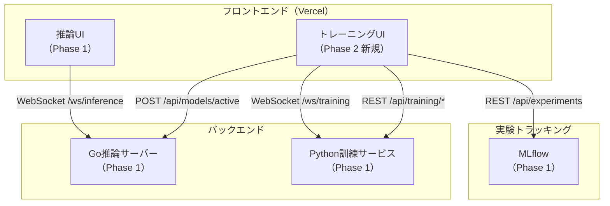
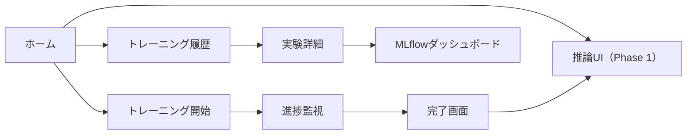

# 設計書 - Phase 2

## 概要

RL Maze Phase 2は、Phase 1で構築した基盤の上に、トレーニングUIを追加し、ユーザーがWebUIから訓練を開始・監視・停止できる機能を実装する。本設計は、Phase 1で確立したクリーンアーキテクチャ・型安全性・バリデーション戦略を維持しながら、新しいUI層を追加する。

Phase 2で追加する主要コンポーネント：

1. **トレーニングUI（Next.js）**: トレーニング設定・進捗監視・実験履歴
2. **トレーニングUIとバックエンドの統合**: Phase 1で実装済みのWebSocket進捗ストリーミング・MLflow統合を活用

Phase 1で既に実装済みの要素：
- Go推論サーバー（APIゲートウェイ機能を含む）
- Python訓練サービス（FastAPI + WebSocket進捗ストリーミング + MLflow統合）
- 推論UI（Next.js）
- OpenAPI定義
- Docker化

## アーキテクチャ

### システム構成図（Phase 2追加部分）



### トレーニングUIのページ構成



## コンポーネントとインターフェース

### 1. トレーニング設定フォーム

**目的**: ユーザーがトレーニングパラメータを設定し、訓練を開始する。

**コンポーネント設計:**

```typescript
// src/components/training/TrainingConfigForm.tsx

interface TrainingConfigFormProps {
  onSubmit: (config: TrainingConfig) => Promise<void>;
  isLoading: boolean;
}

export function TrainingConfigForm({ onSubmit, isLoading }: TrainingConfigFormProps) {
  const form = useForm<TrainingConfig>({
    resolver: zodResolver(TrainingConfigSchema),
    defaultValues: {
      algorithm: 'PPO',
      total_episodes: 1000,
      timesteps_per_episode: 1000,
      maze_size: 10,
    },
  });
  
  return (
    <Form {...form}>
      <FormField
        control={form.control}
        name="algorithm"
        render={({ field }) => (
          <FormItem>
            <FormLabel>アルゴリズム</FormLabel>
            <Select onValueChange={field.onChange} defaultValue={field.value}>
              <SelectTrigger>
                <SelectValue placeholder="アルゴリズムを選択" />
              </SelectTrigger>
              <SelectContent>
                <SelectItem value="PPO">PPO</SelectItem>
                <SelectItem value="DQN">DQN</SelectItem>
              </SelectContent>
            </Select>
            <FormDescription>
              PPOは安定性が高く、DQNは学習速度が速い傾向があります
            </FormDescription>
            <FormMessage />
          </FormItem>
        )}
      />
      
      <FormField
        control={form.control}
        name="total_episodes"
        render={({ field }) => (
          <FormItem>
            <FormLabel>エピソード数</FormLabel>
            <Input
              type="number"
              {...field}
              onChange={(e) => field.onChange(parseInt(e.target.value))}
            />
            <FormDescription>
              1-10000の範囲で指定してください
            </FormDescription>
            <FormMessage />
          </FormItem>
        )}
      />
      
      {/* 他のフィールド... */}
      
      <Button type="submit" disabled={isLoading}>
        {isLoading ? 'トレーニング開始中...' : 'トレーニング開始'}
      </Button>
    </Form>
  );
}
```

**Zodスキーマ:**

```typescript
// src/types/training.ts

import { z } from 'zod';

export const TrainingConfigSchema = z.object({
  algorithm: z.enum(['PPO', 'DQN']),
  total_episodes: z.number().int().min(1).max(10000),
  timesteps_per_episode: z.number().int().min(100).max(10000),
  maze_size: z.number().int().min(5).max(20),
});

export type TrainingConfig = z.infer<typeof TrainingConfigSchema>;

export const TrainingStartResponseSchema = z.object({
  experiment_id: z.string().uuid(),
  status: z.literal('started'),
});

export type TrainingStartResponse = z.infer<typeof TrainingStartResponseSchema>;
```

### 2. トレーニング進捗表示

**目的**: トレーニングの進捗をリアルタイムで表示する。

**コンポーネント設計:**

```typescript
// src/components/training/TrainingProgress.tsx

interface TrainingProgressProps {
  experimentId: string;
}

export function TrainingProgress({ experimentId }: TrainingProgressProps) {
  const { progress, status } = useTrainingProgress(experimentId);
  
  if (status === 'disconnected') {
    return <div>接続が切断されました。再接続中...</div>;
  }
  
  if (!progress) {
    return <div>進捗データを読み込み中...</div>;
  }
  
  return (
    <div className="space-y-6">
      <Card>
        <CardHeader>
          <CardTitle>現在の進捗</CardTitle>
        </CardHeader>
        <CardContent>
          <div className="grid grid-cols-2 gap-4">
            <MetricCard
              label="エピソード"
              value={`${progress.episode} / ${progress.total_episodes}`}
            />
            <MetricCard
              label="報酬"
              value={progress.reward.toFixed(2)}
            />
            <MetricCard
              label="損失"
              value={progress.loss.toFixed(4)}
            />
            <MetricCard
              label="成功率"
              value={`${(progress.success_rate * 100).toFixed(1)}%`}
            />
          </div>
        </CardContent>
      </Card>
      
      <Card>
        <CardHeader>
          <CardTitle>報酬曲線</CardTitle>
        </CardHeader>
        <CardContent>
          <RewardChart data={progress.reward_history} />
        </CardContent>
      </Card>
      
      <Card>
        <CardHeader>
          <CardTitle>成功率曲線</CardTitle>
        </CardHeader>
        <CardContent>
          <SuccessRateChart data={progress.success_rate_history} />
        </CardContent>
      </Card>
      
      <Button onClick={() => stopTraining(experimentId)} variant="destructive">
        トレーニング停止
      </Button>
    </div>
  );
}
```

**カスタムフック:**

```typescript
// src/hooks/useTrainingProgress.ts

export function useTrainingProgress(experimentId: string) {
  const [progress, setProgress] = useState<TrainingProgress | null>(null);
  const [status, setStatus] = useState<'connected' | 'disconnected' | 'reconnecting'>('disconnected');
  const wsRef = useRef<WebSocket | null>(null);
  
  useEffect(() => {
    const connect = () => {
      const ws = new WebSocket(`${process.env.NEXT_PUBLIC_WS_URL}/ws/training/${experimentId}`);
      
      ws.onopen = () => setStatus('connected');
      ws.onclose = () => {
        setStatus('disconnected');
        // 5秒後に自動再接続
        setTimeout(connect, 5000);
      };
      ws.onmessage = (event) => {
        try {
          const data = JSON.parse(event.data);
          const validatedData = TrainingProgressSchema.parse(data);
          setProgress(validatedData);
        } catch (error) {
          console.error('Invalid training progress data:', error);
        }
      };
      
      wsRef.current = ws;
    };
    
    connect();
    
    return () => wsRef.current?.close();
  }, [experimentId]);
  
  return { progress, status };
}
```

**Zodスキーマ:**

```typescript
// src/types/training.ts

export const TrainingProgressSchema = z.object({
  experiment_id: z.string().uuid(),
  episode: z.number().int().min(0),
  total_episodes: z.number().int().min(1),
  reward: z.number(),
  loss: z.number(),
  success_rate: z.number().min(0).max(1),
  reward_history: z.array(z.number()),
  success_rate_history: z.array(z.number()),
  timestamp: z.number().int().positive(),
});

export type TrainingProgress = z.infer<typeof TrainingProgressSchema>;
```

### 3. 実験履歴表示

**目的**: 過去のトレーニング実行履歴を表示する。

**コンポーネント設計:**

```typescript
// src/components/training/ExperimentHistory.tsx

export function ExperimentHistory() {
  const { experiments, isLoading, isError } = useExperiments();
  
  if (isError) return <div>実験一覧の読み込みに失敗しました</div>;
  if (isLoading) return <div>読み込み中...</div>;
  
  return (
    <div className="space-y-4">
      <h2 className="text-2xl font-bold">トレーニング履歴</h2>
      
      <Table>
        <TableHeader>
          <TableRow>
            <TableHead>実験ID</TableHead>
            <TableHead>アルゴリズム</TableHead>
            <TableHead>開始日時</TableHead>
            <TableHead>成功率</TableHead>
            <TableHead>アクション</TableHead>
          </TableRow>
        </TableHeader>
        <TableBody>
          {experiments?.map((exp) => (
            <TableRow key={exp.experiment_id}>
              <TableCell>{exp.experiment_id.slice(0, 8)}</TableCell>
              <TableCell>{exp.algorithm}</TableCell>
              <TableCell>{new Date(exp.started_at).toLocaleString()}</TableCell>
              <TableCell>{(exp.success_rate * 100).toFixed(1)}%</TableCell>
              <TableCell>
                <Button
                  variant="outline"
                  size="sm"
                  onClick={() => router.push(`/training/experiments/${exp.experiment_id}`)}
                >
                  詳細
                </Button>
              </TableCell>
            </TableRow>
          ))}
        </TableBody>
      </Table>
    </div>
  );
}
```

**useSWRフック:**

```typescript
// src/hooks/useExperiments.ts

import useSWR from 'swr';

const fetcher = async (url: string) => {
  const res = await fetch(url);
  if (!res.ok) throw new Error('Failed to fetch experiments');
  const data = await res.json();
  return ExperimentListSchema.parse(data);
};

export function useExperiments() {
  const { data, error, isLoading } = useSWR<Experiment[]>(
    '/api/experiments',
    fetcher,
    {
      refreshInterval: 30000, // 30秒ごとに再検証
    }
  );
  
  return {
    experiments: data,
    isLoading,
    isError: error,
  };
}
```

**Zodスキーマ:**

```typescript
// src/types/training.ts

export const ExperimentSchema = z.object({
  experiment_id: z.string().uuid(),
  algorithm: z.enum(['PPO', 'DQN']),
  started_at: z.string().datetime(),
  success_rate: z.number().min(0).max(1),
  total_episodes: z.number().int().min(1),
});

export type Experiment = z.infer<typeof ExperimentSchema>;

export const ExperimentListSchema = z.array(ExperimentSchema);
```

### 4. 実験詳細表示

**目的**: 特定の実験の詳細メトリクスを表示する。

**コンポーネント設計:**

```typescript
// src/components/training/ExperimentDetail.tsx

interface ExperimentDetailProps {
  experimentId: string;
}

export function ExperimentDetail({ experimentId }: ExperimentDetailProps) {
  const { experiment, isLoading, isError } = useExperiment(experimentId);
  
  if (isError) return <div>実験詳細の読み込みに失敗しました</div>;
  if (isLoading) return <div>読み込み中...</div>;
  
  return (
    <div className="space-y-6">
      <Card>
        <CardHeader>
          <CardTitle>実験情報</CardTitle>
        </CardHeader>
        <CardContent>
          <dl className="grid grid-cols-2 gap-4">
            <div>
              <dt className="font-semibold">実験ID</dt>
              <dd>{experiment.experiment_id}</dd>
            </div>
            <div>
              <dt className="font-semibold">アルゴリズム</dt>
              <dd>{experiment.algorithm}</dd>
            </div>
            <div>
              <dt className="font-semibold">開始日時</dt>
              <dd>{new Date(experiment.started_at).toLocaleString()}</dd>
            </div>
            <div>
              <dt className="font-semibold">最終成功率</dt>
              <dd>{(experiment.success_rate * 100).toFixed(1)}%</dd>
            </div>
          </dl>
        </CardContent>
      </Card>
      
      <Card>
        <CardHeader>
          <CardTitle>エピソード報酬</CardTitle>
        </CardHeader>
        <CardContent>
          <LineChart data={experiment.metrics.episode_rewards} />
        </CardContent>
      </Card>
      
      <Card>
        <CardHeader>
          <CardTitle>損失</CardTitle>
        </CardHeader>
        <CardContent>
          <LineChart data={experiment.metrics.losses} />
        </CardContent>
      </Card>
      
      <Card>
        <CardHeader>
          <CardTitle>成功率</CardTitle>
        </CardHeader>
        <CardContent>
          <LineChart data={experiment.metrics.success_rates} />
        </CardContent>
      </Card>
      
      <Button
        onClick={() => window.open(`${process.env.NEXT_PUBLIC_MLFLOW_URL}/#/experiments/${experimentId}`, '_blank')}
      >
        MLflowダッシュボードで開く
      </Button>
    </div>
  );
}
```

## データモデル

### WebSocket メッセージスキーマ

**トレーニング進捗（サーバー → クライアント）:**

```typescript
interface TrainingProgress {
  experiment_id: string;
  episode: number;
  total_episodes: number;
  reward: number;
  loss: number;
  success_rate: number;
  reward_history: number[];
  success_rate_history: number[];
  timestamp: number;
}
```

**トレーニング停止リクエスト（クライアント → サーバー）:**

```typescript
interface StopTrainingRequest {
  experiment_id: string;
}
```

### REST API スキーマ

**トレーニング開始リクエスト:**

```typescript
interface TrainingStartRequest {
  algorithm: 'PPO' | 'DQN';
  total_episodes: number;
  timesteps_per_episode: number;
  maze_size: number;
}
```

**トレーニング開始レスポンス:**

```typescript
interface TrainingStartResponse {
  experiment_id: string;
  status: 'started';
}
```

**実験一覧レスポンス:**

```typescript
interface Experiment {
  experiment_id: string;
  algorithm: 'PPO' | 'DQN';
  started_at: string;
  success_rate: number;
  total_episodes: number;
}

type ExperimentList = Experiment[];
```

**実験詳細レスポンス:**

```typescript
interface ExperimentDetail {
  experiment_id: string;
  algorithm: 'PPO' | 'DQN';
  started_at: string;
  success_rate: number;
  total_episodes: number;
  metrics: {
    episode_rewards: number[];
    losses: number[];
    success_rates: number[];
  };
}
```

## 正確性プロパティ

*プロパティとは、システムの全ての有効な実行において真であるべき特性や振る舞いである。*

### トレーニングUIプロパティ

**プロパティ1: トレーニング設定のバリデーション完全性**
*任意の* トレーニング設定入力に対して、システムはZodスキーマでバリデーションを実行し、無効な入力を拒否しなければならない
**検証: 要件 1.3, 1.4, 7.1**

**プロパティ2: 進捗更新の継続性**
*任意の* トレーニング実行に対して、システムは10秒以内に進捗を更新しなければならない
**検証: 要件 2.8**

**プロパティ3: WebSocket切断時の自動再接続**
*任意の* WebSocket切断イベントに対して、システムは5秒以内に自動再接続を試みなければならない
**検証: 要件 2.1-2.7**

**プロパティ4: 実験一覧の完全性**
*任意の* 実験一覧リクエストに対して、システムはMLflowに登録された全ての実験を返さなければならない
**検証: 要件 4.1, 4.2**

**プロパティ5: モデル切り替えの一貫性**
*任意の* トレーニング完了後のモデル切り替えに対して、システムはアクティブモデルを更新し、推論UIで使用可能にしなければならない
**検証: 要件 5.3, 5.4, 5.5**

**プロパティ6: コンポーネントの独立性**
*全ての* トレーニングUIコンポーネントは、推論UIコンポーネントと独立してテスト可能でなければならない
**検証: 要件 6.1-6.6**

**プロパティ7: エラーメッセージの明確性**
*任意の* バリデーションエラーまたはAPIエラーに対して、システムはユーザーに明確なエラーメッセージを表示しなければならない
**検証: 要件 7.4, 8.2, 8.6**

**プロパティ8: Phase 1機能の非破壊性**
*全ての* Phase 2の変更は、Phase 1で実装した推論UIの機能に影響を与えてはならない
**検証: 要件 成功条件 10**

## バリデーション戦略

Phase 2では、Phase 1で確立したバリデーション戦略を継承し、トレーニングUIに適用する。

### フロントエンドバリデーション（TypeScript + Zod）

**トレーニング設定フォームのバリデーション:**

```typescript
import { z } from 'zod';

export const TrainingConfigSchema = z.object({
  algorithm: z.enum(['PPO', 'DQN'], {
    errorMap: () => ({ message: 'PPOまたはDQNを選択してください' }),
  }),
  total_episodes: z.number().int().min(1).max(10000, {
    message: 'エピソード数は1-10000の範囲で指定してください',
  }),
  timesteps_per_episode: z.number().int().min(100).max(10000, {
    message: 'ステップ数は100-10000の範囲で指定してください',
  }),
  maze_size: z.number().int().min(5).max(20, {
    message: '迷路サイズは5-20の範囲で指定してください',
  }),
});

// フォーム送信時のバリデーション
async function handleSubmit(data: unknown) {
  try {
    const validatedData = TrainingConfigSchema.parse(data);
    await startTraining(validatedData);
  } catch (error) {
    if (error instanceof z.ZodError) {
      // エラーメッセージをフォームに表示
      error.errors.forEach((err) => {
        form.setError(err.path[0] as any, {
          message: err.message,
        });
      });
    }
  }
}
```

## エラーハンドリング

### エラー分類

| エラー分類 | 例 | 処理方針 |
|-----------|---|---------|
| バリデーションエラー | 無効なエピソード数、範囲外の迷路サイズ | フォームフィールド下に赤色でエラーメッセージ表示 |
| APIエラー | 訓練サービス接続失敗、MLflow接続失敗 | トーストでエラーメッセージ表示・リトライボタン提供 |
| WebSocket切断 | ネットワーク切断、サーバー再起動 | 自動再接続（5秒間隔）・ステータス表示更新 |
| トレーニング失敗 | 収束しない、メモリ不足 | エラーメッセージ表示・MLflowログへのリンク提供 |

### エラーハンドリング実装例

**フォームバリデーションエラー:**

```typescript
<FormField
  control={form.control}
  name="total_episodes"
  render={({ field }) => (
    <FormItem>
      <FormLabel>エピソード数</FormLabel>
      <Input type="number" {...field} />
      <FormMessage /> {/* Zodエラーメッセージを自動表示 */}
    </FormItem>
  )}
/>
```

**APIエラー:**

```typescript
async function startTraining(config: TrainingConfig) {
  try {
    const response = await fetch('/api/training/start', {
      method: 'POST',
      headers: { 'Content-Type': 'application/json' },
      body: JSON.stringify(config),
    });
    
    if (!response.ok) {
      throw new Error('トレーニングの開始に失敗しました');
    }
    
    const data = await response.json();
    return TrainingStartResponseSchema.parse(data);
  } catch (error) {
    toast.error('トレーニングの開始に失敗しました', {
      description: error.message,
      action: {
        label: 'リトライ',
        onClick: () => startTraining(config),
      },
    });
    throw error;
  }
}
```

## テスト戦略

Phase 2では、Phase 1で確立したテスト戦略を継承し、トレーニングUIに適用する。

### プロパティベーステスト

**使用ライブラリ:** `fast-check` (TypeScript)

**トレーニング設定バリデーションのプロパティテスト:**

```typescript
import fc from 'fast-check';
import { describe, it, expect } from 'vitest';

// **Feature: rl-maze-phase2, Property 1: トレーニング設定のバリデーション完全性**
describe('Property 1: Training config validation completeness', () => {
  it('任意の無効な設定に対してバリデーションエラーを返す', () => {
    fc.assert(
      fc.property(
        fc.record({
          algorithm: fc.constantFrom('PPO', 'DQN', 'INVALID'),
          total_episodes: fc.integer({ min: -100, max: 20000 }),
          timesteps_per_episode: fc.integer({ min: -100, max: 20000 }),
          maze_size: fc.integer({ min: -10, max: 50 }),
        }),
        (config) => {
          const result = TrainingConfigSchema.safeParse(config);
          
          // 有効な範囲外の値はエラーになるべき
          if (
            config.algorithm === 'INVALID' ||
            config.total_episodes < 1 ||
            config.total_episodes > 10000 ||
            config.timesteps_per_episode < 100 ||
            config.timesteps_per_episode > 10000 ||
            config.maze_size < 5 ||
            config.maze_size > 20
          ) {
            expect(result.success).toBe(false);
          } else {
            expect(result.success).toBe(true);
          }
          
          return true;
        }
      ),
      { numRuns: 100 }
    );
  });
});
```

### ユニットテスト

**使用ライブラリ:** `vitest` + `@testing-library/react` + `@testing-library/user-event`

フロントエンドのユニットテストは、Jest互換のvitestとTesting Libraryを使用して実装する。Testing Libraryは、ユーザーの視点からコンポーネントをテストすることを重視し、実装の詳細ではなく振る舞いをテストする。

**コンポーネントテスト:**

```typescript
import { render, screen, fireEvent } from '@testing-library/react';
import { TrainingConfigForm } from '@/components/training/TrainingConfigForm';

describe('TrainingConfigForm', () => {
  it('無効なエピソード数でエラーメッセージを表示', async () => {
    const onSubmit = vi.fn();
    render(<TrainingConfigForm onSubmit={onSubmit} isLoading={false} />);
    
    const episodesInput = screen.getByLabelText('エピソード数');
    fireEvent.change(episodesInput, { target: { value: '20000' } });
    
    const submitButton = screen.getByText('トレーニング開始');
    fireEvent.click(submitButton);
    
    expect(await screen.findByText('エピソード数は1-10000の範囲で指定してください')).toBeInTheDocument();
    expect(onSubmit).not.toHaveBeenCalled();
  });
  
  it('有効な設定でトレーニングを開始する', async () => {
    const onSubmit = vi.fn();
    const user = userEvent.setup();
    
    render(<TrainingConfigForm onSubmit={onSubmit} isLoading={false} />);
    
    // アルゴリズムを選択
    const algorithmSelect = screen.getByRole('combobox', { name: /アルゴリズム/i });
    await user.click(algorithmSelect);
    await user.click(screen.getByText('PPO'));
    
    // エピソード数を入力
    const episodesInput = screen.getByLabelText('エピソード数');
    await user.clear(episodesInput);
    await user.type(episodesInput, '1000');
    
    // 送信
    const submitButton = screen.getByText('トレーニング開始');
    await user.click(submitButton);
    
    expect(onSubmit).toHaveBeenCalledWith({
      algorithm: 'PPO',
      total_episodes: 1000,
      timesteps_per_episode: 1000,
      maze_size: 10,
    });
  });
});

describe('TrainingProgress', () => {
  it('進捗データを表示する', () => {
    const progress = {
      experiment_id: 'test-id',
      episode: 50,
      total_episodes: 100,
      reward: 0.8,
      loss: 0.02,
      success_rate: 0.65,
      reward_history: [0.1, 0.3, 0.5, 0.8],
      success_rate_history: [0.2, 0.4, 0.5, 0.65],
      timestamp: Date.now(),
    };
    
    render(<TrainingProgress experimentId="test-id" />);
    
    // モックデータを注入（useTrainingProgressフックをモック）
    
    expect(screen.getByText(/50 \/ 100/)).toBeInTheDocument();
    expect(screen.getByText(/0\.80/)).toBeInTheDocument();
    expect(screen.getByText(/65\.0%/)).toBeInTheDocument();
  });
  
  it('停止ボタンをクリックするとトレーニングを停止する', async () => {
    const stopTraining = vi.fn();
    const user = userEvent.setup();
    
    render(<TrainingProgress experimentId="test-id" />);
    
    const stopButton = screen.getByRole('button', { name: /停止/i });
    await user.click(stopButton);
    
    expect(stopTraining).toHaveBeenCalledWith('test-id');
  });
});
```

**カスタムフックテスト:**

```typescript
import { renderHook, waitFor } from '@testing-library/react';
import { useTrainingProgress } from '@/hooks/useTrainingProgress';

describe('useTrainingProgress', () => {
  it('WebSocket接続を確立して進捗を受信する', async () => {
    const { result } = renderHook(() => useTrainingProgress('test-experiment-id'));
    
    await waitFor(() => {
      expect(result.current.status).toBe('connected');
    });
    
    // WebSocketモックでデータを送信
    // ...
    
    await waitFor(() => {
      expect(result.current.progress).not.toBeNull();
    });
  });
  
  it('WebSocket切断時に自動再接続を試みる', async () => {
    const { result } = renderHook(() => useTrainingProgress('test-experiment-id'));
    
    // WebSocketを切断
    // ...
    
    await waitFor(() => {
      expect(result.current.status).toBe('disconnected');
    });
    
    // 5秒後に再接続を確認
    await waitFor(
      () => {
        expect(result.current.status).toBe('reconnecting');
      },
      { timeout: 6000 }
    );
  });
});
```

**統合テスト（エンドツーエンドフロー）:**

```typescript
import { render, screen, waitFor } from '@testing-library/react';
import userEvent from '@testing-library/user-event';
import { TrainingPage } from '@/app/training/page';

describe('Training Flow Integration', () => {
  it('トレーニング開始から進捗監視までのフロー', async () => {
    const user = userEvent.setup();
    render(<TrainingPage />);
    
    // トレーニング設定を入力
    const algorithmSelect = screen.getByRole('combobox', { name: /アルゴリズム/i });
    await user.click(algorithmSelect);
    await user.click(screen.getByText('PPO'));
    
    const episodesInput = screen.getByLabelText('エピソード数');
    await user.clear(episodesInput);
    await user.type(episodesInput, '100');
    
    // トレーニング開始
    const submitButton = screen.getByText('トレーニング開始');
    await user.click(submitButton);
    
    // 進捗画面に遷移
    await waitFor(() => {
      expect(screen.getByText(/現在の進捗/i)).toBeInTheDocument();
    });
    
    // 進捗データが表示される
    await waitFor(() => {
      expect(screen.getByText(/エピソード/i)).toBeInTheDocument();
      expect(screen.getByText(/報酬/i)).toBeInTheDocument();
    });
  });
});
```

**テスト設定（vitest.config.ts）:**

```typescript
import { defineConfig } from 'vitest/config';
import react from '@vitejs/plugin-react';
import path from 'path';

export default defineConfig({
  plugins: [react()],
  test: {
    environment: 'jsdom',
    globals: true,
    setupFiles: ['./src/test/setup.ts'],
  },
  resolve: {
    alias: {
      '@': path.resolve(__dirname, './src'),
    },
  },
});
```

**テストセットアップ（src/test/setup.ts）:**

```typescript
import '@testing-library/jest-dom';
import { vi } from 'vitest';

// WebSocketモック
global.WebSocket = vi.fn(() => ({
  onopen: vi.fn(),
  onclose: vi.fn(),
  onmessage: vi.fn(),
  onerror: vi.fn(),
  send: vi.fn(),
  close: vi.fn(),
})) as any;

// fetchモック
global.fetch = vi.fn();

// console.errorをモック（バリデーションエラーテスト用）
global.console.error = vi.fn();
```

## 実装優先順位

Phase 2の実装は以下の順序で進める：

1. **トレーニング設定フォーム**
   - Zodスキーマ定義
   - フォームコンポーネント実装
   - バリデーション実装

2. **トレーニング進捗表示**
   - WebSocketフック実装
   - 進捗表示コンポーネント実装
   - リアルタイムグラフ実装

3. **実験履歴・詳細表示**
   - useSWRフック実装
   - 実験一覧コンポーネント実装
   - 実験詳細コンポーネント実装

4. **統合・テスト**
   - エンドツーエンドフロー確認
   - プロパティテスト追加
   - Phase 1機能の非破壊性確認
