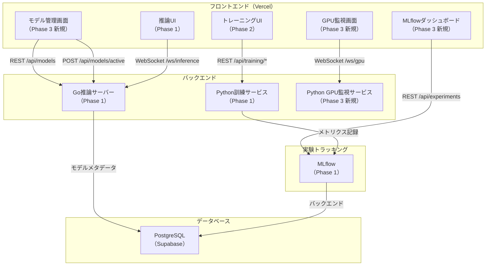
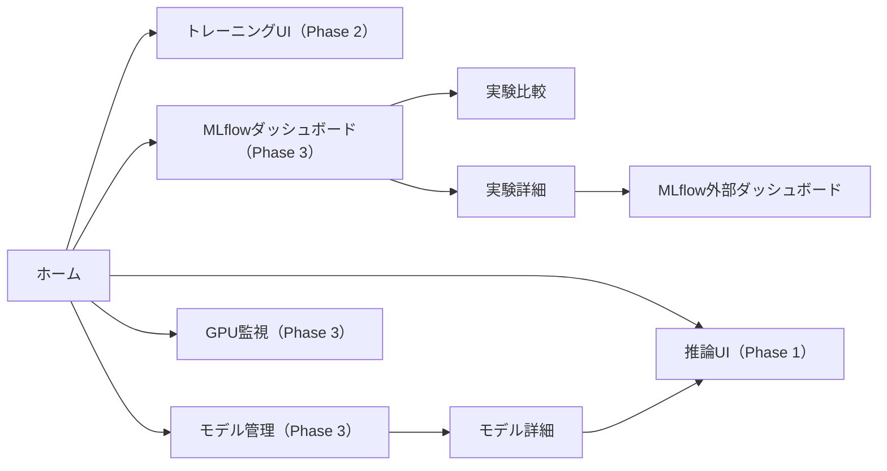
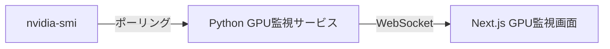

# 設計書 - Phase 3

## 概要

RL Maze Phase 3は、Phase 1・Phase 2で構築した基盤の上に、MLflowダッシュボード統合・モデル管理画面・GPUリソース監視機能を追加し、エンタープライズ水準の運用機能を完成させる。本設計は、Phase 1・Phase 2で確立したクリーンアーキテクチャ・型安全性・バリデーション戦略を維持しながら、新しい管理UI層を追加する。

Phase 3で追加する主要コンポーネント：

1. **MLflowダッシュボード（Next.js）**: 実験比較・メトリクス可視化
2. **モデル管理画面（Next.js）**: モデル一覧・切り替え・削除
3. **GPUリソース監視（Python + Next.js）**: nvidia-smiポーリング・リアルタイム表示

Phase 1・Phase 2で既に実装済みの要素：
- Go推論サーバー（APIゲートウェイ機能を含む）
- Python訓練サービス（FastAPI + WebSocket進捗ストリーミング + MLflow統合）
- 推論UI（Next.js）
- トレーニングUI（Next.js）
- OpenAPI定義
- Docker化

## アーキテクチャ

### システム構成図（Phase 3追加部分）




### Phase 3のページ構成



## コンポーネントとインターフェース

### 1. MLflowダッシュボード

**目的**: MLflowの実験データを可視化し、複数実験を比較できるようにする。

**コンポーネント設計:**

**ExperimentList.tsx:**
```typescript
// src/components/mlflow/ExperimentList.tsx

interface ExperimentListProps {
  onCompare: (experimentIds: string[]) => void;
}

export function ExperimentList({ onCompare }: ExperimentListProps) {
  const { experiments, isLoading, isError } = useExperiments();
  const [selectedIds, setSelectedIds] = useState<string[]>([]);
  const [sortBy, setSortBy] = useState<'date' | 'success_rate'>('date');
  const [filterAlgorithm, setFilterAlgorithm] = useState<'all' | 'PPO' | 'DQN'>('all');
  
  const filteredExperiments = useMemo(() => {
    let filtered = experiments || [];
    
    // フィルター
    if (filterAlgorithm !== 'all') {
      filtered = filtered.filter(exp => exp.algorithm === filterAlgorithm);
    }
    
    // ソート
    filtered.sort((a, b) => {
      if (sortBy === 'date') {
        return new Date(b.started_at).getTime() - new Date(a.started_at).getTime();
      } else {
        return b.success_rate - a.success_rate;
      }
    });
    
    return filtered;
  }, [experiments, sortBy, filterAlgorithm]);
  
  if (isError) return <div>実験一覧の読み込みに失敗しました</div>;
  if (isLoading) return <div>読み込み中...</div>;
  
  return (
    <div className="space-y-4">
      <div className="flex justify-between items-center">
        <h2 className="text-2xl font-bold">実験一覧</h2>
        <div className="flex gap-2">
          <Select value={sortBy} onValueChange={(v) => setSortBy(v as any)}>
            <SelectTrigger className="w-[180px]">
              <SelectValue placeholder="ソート" />
            </SelectTrigger>
            <SelectContent>
              <SelectItem value="date">日時順</SelectItem>
              <SelectItem value="success_rate">成功率順</SelectItem>
            </SelectContent>
          </Select>
          
          <Select value={filterAlgorithm} onValueChange={(v) => setFilterAlgorithm(v as any)}>
            <SelectTrigger className="w-[180px]">
              <SelectValue placeholder="フィルター" />
            </SelectTrigger>
            <SelectContent>
              <SelectItem value="all">全て</SelectItem>
              <SelectItem value="PPO">PPO</SelectItem>
              <SelectItem value="DQN">DQN</SelectItem>
            </SelectContent>
          </Select>
        </div>
      </div>
      
      <Table>
        <TableHeader>
          <TableRow>
            <TableHead className="w-[50px]">選択</TableHead>
            <TableHead>実験ID</TableHead>
            <TableHead>アルゴリズム</TableHead>
            <TableHead>開始日時</TableHead>
            <TableHead>成功率</TableHead>
            <TableHead>エピソード数</TableHead>
            <TableHead>アクション</TableHead>
          </TableRow>
        </TableHeader>
        <TableBody>
          {filteredExperiments.map((exp) => (
            <TableRow key={exp.experiment_id}>
              <TableCell>
                <Checkbox
                  checked={selectedIds.includes(exp.experiment_id)}
                  onCheckedChange={(checked) => {
                    if (checked) {
                      setSelectedIds([...selectedIds, exp.experiment_id]);
                    } else {
                      setSelectedIds(selectedIds.filter(id => id !== exp.experiment_id));
                    }
                  }}
                />
              </TableCell>
              <TableCell>{exp.experiment_id.slice(0, 8)}</TableCell>
              <TableCell>
                <Badge variant={exp.algorithm === 'PPO' ? 'default' : 'secondary'}>
                  {exp.algorithm}
                </Badge>
              </TableCell>
              <TableCell>{new Date(exp.started_at).toLocaleString()}</TableCell>
              <TableCell>{(exp.success_rate * 100).toFixed(1)}%</TableCell>
              <TableCell>{exp.total_episodes}</TableCell>
              <TableCell>
                <Button
                  variant="outline"
                  size="sm"
                  onClick={() => router.push(`/mlflow/experiments/${exp.experiment_id}`)}
                >
                  詳細
                </Button>
              </TableCell>
            </TableRow>
          ))}
        </TableBody>
      </Table>
      
      {selectedIds.length > 0 && (
        <div className="flex justify-end">
          <Button onClick={() => onCompare(selectedIds)}>
            {selectedIds.length}件の実験を比較
          </Button>
        </div>
      )}
    </div>
  );
}
```


**ExperimentComparison.tsx:**
```typescript
// src/components/mlflow/ExperimentComparison.tsx

interface ExperimentComparisonProps {
  experimentIds: string[];
}

export function ExperimentComparison({ experimentIds }: ExperimentComparisonProps) {
  const experiments = experimentIds.map(id => useExperiment(id));
  
  const allLoaded = experiments.every(exp => !exp.isLoading);
  const hasError = experiments.some(exp => exp.isError);
  
  if (hasError) return <div>実験データの読み込みに失敗しました</div>;
  if (!allLoaded) return <div>読み込み中...</div>;
  
  const experimentsData = experiments.map(exp => exp.experiment).filter(Boolean);
  
  return (
    <div className="space-y-6">
      <h2 className="text-2xl font-bold">実験比較</h2>
      
      {/* 最終メトリクス比較表 */}
      <Card>
        <CardHeader>
          <CardTitle>最終メトリクス比較</CardTitle>
        </CardHeader>
        <CardContent>
          <Table>
            <TableHeader>
              <TableRow>
                <TableHead>実験ID</TableHead>
                <TableHead>アルゴリズム</TableHead>
                <TableHead>最終報酬</TableHead>
                <TableHead>最終成功率</TableHead>
                <TableHead>総エピソード数</TableHead>
              </TableRow>
            </TableHeader>
            <TableBody>
              {experimentsData.map((exp) => (
                <TableRow key={exp.experiment_id}>
                  <TableCell>{exp.experiment_id.slice(0, 8)}</TableCell>
                  <TableCell>{exp.algorithm}</TableCell>
                  <TableCell>
                    {exp.metrics.episode_rewards[exp.metrics.episode_rewards.length - 1].toFixed(2)}
                  </TableCell>
                  <TableCell>{(exp.success_rate * 100).toFixed(1)}%</TableCell>
                  <TableCell>{exp.total_episodes}</TableCell>
                </TableRow>
              ))}
            </TableBody>
          </Table>
        </CardContent>
      </Card>
      
      {/* エピソード報酬比較グラフ */}
      <Card>
        <CardHeader>
          <CardTitle>エピソード報酬推移</CardTitle>
        </CardHeader>
        <CardContent>
          <ComparisonLineChart
            datasets={experimentsData.map(exp => ({
              label: `${exp.algorithm} (${exp.experiment_id.slice(0, 8)})`,
              data: exp.metrics.episode_rewards,
            }))}
            xLabel="エピソード"
            yLabel="報酬"
          />
        </CardContent>
      </Card>
      
      {/* 成功率比較グラフ */}
      <Card>
        <CardHeader>
          <CardTitle>成功率推移</CardTitle>
        </CardHeader>
        <CardContent>
          <ComparisonLineChart
            datasets={experimentsData.map(exp => ({
              label: `${exp.algorithm} (${exp.experiment_id.slice(0, 8)})`,
              data: exp.metrics.success_rates,
            }))}
            xLabel="エピソード"
            yLabel="成功率"
          />
        </CardContent>
      </Card>
      
      {/* 損失比較グラフ */}
      <Card>
        <CardHeader>
          <CardTitle>損失推移</CardTitle>
        </CardHeader>
        <CardContent>
          <ComparisonLineChart
            datasets={experimentsData.map(exp => ({
              label: `${exp.algorithm} (${exp.experiment_id.slice(0, 8)})`,
              data: exp.metrics.losses,
            }))}
            xLabel="エピソード"
            yLabel="損失"
          />
        </CardContent>
      </Card>
    </div>
  );
}
```

**Zodスキーマ:**

```typescript
// src/types/mlflow.ts

import { z } from 'zod';

export const ExperimentSchema = z.object({
  experiment_id: z.string().uuid(),
  algorithm: z.enum(['PPO', 'DQN']),
  started_at: z.string().datetime(),
  success_rate: z.number().min(0).max(1),
  total_episodes: z.number().int().min(1),
});

export type Experiment = z.infer<typeof ExperimentSchema>;

export const ExperimentListSchema = z.array(ExperimentSchema);

export const ExperimentDetailSchema = z.object({
  experiment_id: z.string().uuid(),
  algorithm: z.enum(['PPO', 'DQN']),
  started_at: z.string().datetime(),
  success_rate: z.number().min(0).max(1),
  total_episodes: z.number().int().min(1),
  metrics: z.object({
    episode_rewards: z.array(z.number()),
    losses: z.array(z.number()),
    success_rates: z.array(z.number()),
  }),
});

export type ExperimentDetail = z.infer<typeof ExperimentDetailSchema>;
```


### 2. モデル管理画面

**目的**: 訓練済みモデルの一覧・切り替え・削除を一元管理する。

**コンポーネント設計:**

**ModelList.tsx:**
```typescript
// src/components/models/ModelList.tsx

export function ModelList() {
  const { models, isLoading, isError, mutate } = useModels();
  const { activeModel } = useActiveModel();
  const [sortBy, setSortBy] = useState<'date' | 'success_rate'>('date');
  const [filterAlgorithm, setFilterAlgorithm] = useState<'all' | 'PPO' | 'DQN'>('all');
  const [filterActive, setFilterActive] = useState<'all' | 'active' | 'inactive'>('all');
  
  const filteredModels = useMemo(() => {
    let filtered = models || [];
    
    // フィルター: アルゴリズム
    if (filterAlgorithm !== 'all') {
      filtered = filtered.filter(model => model.algorithm === filterAlgorithm);
    }
    
    // フィルター: アクティブ状態
    if (filterActive === 'active') {
      filtered = filtered.filter(model => model.id === activeModel?.id);
    } else if (filterActive === 'inactive') {
      filtered = filtered.filter(model => model.id !== activeModel?.id);
    }
    
    // ソート
    filtered.sort((a, b) => {
      if (sortBy === 'date') {
        return new Date(b.trained_at).getTime() - new Date(a.trained_at).getTime();
      } else {
        return b.success_rate - a.success_rate;
      }
    });
    
    return filtered;
  }, [models, activeModel, sortBy, filterAlgorithm, filterActive]);
  
  if (isError) return <div>モデル一覧の読み込みに失敗しました</div>;
  if (isLoading) return <div>読み込み中...</div>;
  
  return (
    <div className="space-y-4">
      <div className="flex justify-between items-center">
        <h2 className="text-2xl font-bold">モデル管理</h2>
        <div className="flex gap-2">
          <Select value={sortBy} onValueChange={(v) => setSortBy(v as any)}>
            <SelectTrigger className="w-[180px]">
              <SelectValue placeholder="ソート" />
            </SelectTrigger>
            <SelectContent>
              <SelectItem value="date">日時順</SelectItem>
              <SelectItem value="success_rate">成功率順</SelectItem>
            </SelectContent>
          </Select>
          
          <Select value={filterAlgorithm} onValueChange={(v) => setFilterAlgorithm(v as any)}>
            <SelectTrigger className="w-[180px]">
              <SelectValue placeholder="アルゴリズム" />
            </SelectTrigger>
            <SelectContent>
              <SelectItem value="all">全て</SelectItem>
              <SelectItem value="PPO">PPO</SelectItem>
              <SelectItem value="DQN">DQN</SelectItem>
            </SelectContent>
          </Select>
          
          <Select value={filterActive} onValueChange={(v) => setFilterActive(v as any)}>
            <SelectTrigger className="w-[180px]">
              <SelectValue placeholder="状態" />
            </SelectTrigger>
            <SelectContent>
              <SelectItem value="all">全て</SelectItem>
              <SelectItem value="active">アクティブ</SelectItem>
              <SelectItem value="inactive">非アクティブ</SelectItem>
            </SelectContent>
          </Select>
        </div>
      </div>
      
      <Table>
        <TableHeader>
          <TableRow>
            <TableHead>モデルID</TableHead>
            <TableHead>アルゴリズム</TableHead>
            <TableHead>訓練日時</TableHead>
            <TableHead>成功率</TableHead>
            <TableHead>状態</TableHead>
            <TableHead>アクション</TableHead>
          </TableRow>
        </TableHeader>
        <TableBody>
          {filteredModels.map((model) => {
            const isActive = model.id === activeModel?.id;
            
            return (
              <TableRow key={model.id}>
                <TableCell>{model.id.slice(0, 8)}</TableCell>
                <TableCell>
                  <Badge variant={model.algorithm === 'PPO' ? 'default' : 'secondary'}>
                    {model.algorithm}
                  </Badge>
                </TableCell>
                <TableCell>{new Date(model.trained_at).toLocaleString()}</TableCell>
                <TableCell>{(model.success_rate * 100).toFixed(1)}%</TableCell>
                <TableCell>
                  {isActive && (
                    <Badge variant="success">アクティブ</Badge>
                  )}
                </TableCell>
                <TableCell>
                  <div className="flex gap-2">
                    {!isActive && (
                      <Button
                        variant="outline"
                        size="sm"
                        onClick={() => handleActivate(model.id, mutate)}
                      >
                        アクティブ化
                      </Button>
                    )}
                    <Button
                      variant="outline"
                      size="sm"
                      onClick={() => router.push(`/models/${model.id}`)}
                    >
                      詳細
                    </Button>
                    {!isActive && (
                      <Button
                        variant="destructive"
                        size="sm"
                        onClick={() => handleDelete(model.id, mutate)}
                      >
                        削除
                      </Button>
                    )}
                  </div>
                </TableCell>
              </TableRow>
            );
          })}
        </TableBody>
      </Table>
    </div>
  );
}

async function handleActivate(modelId: string, mutate: KeyedMutator<Model[]>) {
  try {
    await setActiveModel(modelId, mutate);
    toast.success('モデルをアクティブ化しました');
  } catch (error) {
    toast.error('モデルのアクティブ化に失敗しました');
  }
}

async function handleDelete(modelId: string, mutate: KeyedMutator<Model[]>) {
  const confirmed = await confirm({
    title: 'モデルを削除しますか？',
    description: 'この操作は取り消せません。',
  });
  
  if (!confirmed) return;
  
  try {
    await deleteModel(modelId);
    mutate(); // モデル一覧を再取得
    toast.success('モデルを削除しました');
  } catch (error) {
    toast.error('モデルの削除に失敗しました');
  }
}
```

**Zodスキーマ:**

```typescript
// src/types/models.ts

import { z } from 'zod';

export const ModelSchema = z.object({
  id: z.string().uuid(),
  algorithm: z.enum(['PPO', 'DQN']),
  trained_at: z.string().datetime(),
  success_rate: z.number().min(0).max(1),
  onnx_path: z.string(),
});

export type Model = z.infer<typeof ModelSchema>;

export const ModelListSchema = z.array(ModelSchema);

export const ModelDetailSchema = z.object({
  id: z.string().uuid(),
  algorithm: z.enum(['PPO', 'DQN']),
  trained_at: z.string().datetime(),
  success_rate: z.number().min(0).max(1),
  total_episodes: z.number().int().min(1),
  onnx_path: z.string(),
});

export type ModelDetail = z.infer<typeof ModelDetailSchema>;
```


### 3. GPUリソース監視

**目的**: ローカル実機のGPU使用状況をリアルタイムで監視する。

**アーキテクチャ:**



**Python GPU監視サービス:**

```python
# backend/gpu_monitor/main.py

import asyncio
import subprocess
import json
from fastapi import FastAPI, WebSocket
from fastapi.middleware.cors import CORSMiddleware
import xml.etree.ElementTree as ET

app = FastAPI()

app.add_middleware(
    CORSMiddleware,
    allow_origins=["*"],
    allow_credentials=True,
    allow_methods=["*"],
    allow_headers=["*"],
)

def get_gpu_info():
    """nvidia-smiの出力をパースしてGPU情報を取得"""
    try:
        result = subprocess.run(
            ['nvidia-smi', '-q', '-x'],
            capture_output=True,
            text=True,
            check=True
        )
        
        root = ET.fromstring(result.stdout)
        gpu = root.find('gpu')
        
        if gpu is None:
            return None
        
        utilization = gpu.find('utilization')
        fb_memory = gpu.find('fb_memory_usage')
        temperature = gpu.find('temperature')
        
        return {
            'gpu_id': gpu.find('product_name').text,
            'utilization': float(utilization.find('gpu_util').text.replace('%', '').strip()),
            'memory_used': float(fb_memory.find('used').text.split()[0]),
            'memory_total': float(fb_memory.find('total').text.split()[0]),
            'temperature': float(temperature.find('gpu_temp').text.split()[0]),
            'timestamp': int(time.time() * 1000),
        }
    except Exception as e:
        print(f"Error getting GPU info: {e}")
        return None

@app.websocket("/ws/gpu")
async def websocket_gpu_monitor(websocket: WebSocket):
    await websocket.accept()
    
    try:
        while True:
            gpu_info = get_gpu_info()
            
            if gpu_info:
                await websocket.send_json(gpu_info)
            else:
                await websocket.send_json({
                    'error': 'GPU情報を取得できませんでした'
                })
            
            await asyncio.sleep(5)  # 5秒ごとに更新
    except Exception as e:
        print(f"WebSocket error: {e}")
    finally:
        await websocket.close()

@app.get("/health")
async def health_check():
    return {"status": "healthy"}
```

**Next.js GPU監視画面:**

```typescript
// src/components/gpu/GPUMonitor.tsx

export function GPUMonitor() {
  const { gpuInfo, status } = useGPUMonitor();
  
  if (status === 'disconnected') {
    return (
      <div className="flex items-center justify-center h-64">
        <div className="text-center">
          <p className="text-red-500">GPU監視サービスに接続できません</p>
          <p className="text-sm text-gray-500 mt-2">
            ローカル実機でGPU監視サービスが起動しているか確認してください
          </p>
        </div>
      </div>
    );
  }
  
  if (!gpuInfo) {
    return <div>GPU情報を読み込み中...</div>;
  }
  
  if ('error' in gpuInfo) {
    return (
      <div className="flex items-center justify-center h-64">
        <div className="text-center">
          <p className="text-red-500">{gpuInfo.error}</p>
        </div>
      </div>
    );
  }
  
  return (
    <div className="space-y-6">
      <h2 className="text-2xl font-bold">GPUリソース監視</h2>
      
      <div className="grid grid-cols-1 md:grid-cols-3 gap-4">
        {/* GPU使用率 */}
        <Card>
          <CardHeader>
            <CardTitle>GPU使用率</CardTitle>
          </CardHeader>
          <CardContent>
            <div className="text-4xl font-bold">
              {gpuInfo.utilization.toFixed(1)}%
            </div>
            <Progress value={gpuInfo.utilization} className="mt-2" />
          </CardContent>
        </Card>
        
        {/* メモリ使用量 */}
        <Card>
          <CardHeader>
            <CardTitle>メモリ使用量</CardTitle>
          </CardHeader>
          <CardContent>
            <div className="text-4xl font-bold">
              {gpuInfo.memory_used.toFixed(0)} MB
            </div>
            <div className="text-sm text-gray-500 mt-2">
              / {gpuInfo.memory_total.toFixed(0)} MB
            </div>
            <Progress 
              value={(gpuInfo.memory_used / gpuInfo.memory_total) * 100} 
              className="mt-2" 
            />
          </CardContent>
        </Card>
        
        {/* 温度 */}
        <Card>
          <CardHeader>
            <CardTitle>温度</CardTitle>
          </CardHeader>
          <CardContent>
            <div className="text-4xl font-bold">
              {gpuInfo.temperature.toFixed(0)}°C
            </div>
            <div className="text-sm text-gray-500 mt-2">
              {gpuInfo.gpu_id}
            </div>
          </CardContent>
        </Card>
      </div>
      
      {/* GPU使用率推移グラフ */}
      <Card>
        <CardHeader>
          <CardTitle>GPU使用率推移</CardTitle>
        </CardHeader>
        <CardContent>
          <GPUUtilizationChart />
        </CardContent>
      </Card>
    </div>
  );
}
```

**useGPUMonitor カスタムフック:**

```typescript
// src/hooks/useGPUMonitor.ts

export function useGPUMonitor() {
  const [gpuInfo, setGpuInfo] = useState<GPUInfo | null>(null);
  const [status, setStatus] = useState<'connected' | 'disconnected' | 'reconnecting'>('disconnected');
  const [history, setHistory] = useState<GPUInfo[]>([]);
  const wsRef = useRef<WebSocket | null>(null);
  
  useEffect(() => {
    const connect = () => {
      const ws = new WebSocket(`${process.env.NEXT_PUBLIC_GPU_MONITOR_URL}/ws/gpu`);
      
      ws.onopen = () => setStatus('connected');
      ws.onclose = () => {
        setStatus('disconnected');
        // 5秒後に自動再接続
        setTimeout(connect, 5000);
      };
      ws.onmessage = (event) => {
        try {
          const data = JSON.parse(event.data);
          const validatedData = GPUInfoSchema.parse(data);
          
          setGpuInfo(validatedData);
          setHistory(prev => [...prev.slice(-59), validatedData]); // 直近60件を保持
        } catch (error) {
          console.error('Invalid GPU info data:', error);
        }
      };
      
      wsRef.current = ws;
    };
    
    connect();
    
    return () => wsRef.current?.close();
  }, []);
  
  return { gpuInfo, status, history };
}
```

**Zodスキーマ:**

```typescript
// src/types/gpu.ts

import { z } from 'zod';

export const GPUInfoSchema = z.object({
  gpu_id: z.string(),
  utilization: z.number().min(0).max(100),
  memory_used: z.number().min(0),
  memory_total: z.number().min(0),
  temperature: z.number().min(0),
  timestamp: z.number().int().positive(),
});

export type GPUInfo = z.infer<typeof GPUInfoSchema>;

export const GPUErrorSchema = z.object({
  error: z.string(),
});

export type GPUError = z.infer<typeof GPUErrorSchema>;
```


## データモデル

### REST API スキーマ

**実験一覧レスポンス:**

```typescript
interface Experiment {
  experiment_id: string;
  algorithm: 'PPO' | 'DQN';
  started_at: string;
  success_rate: number;
  total_episodes: number;
}

type ExperimentList = Experiment[];
```

**実験詳細レスポンス:**

```typescript
interface ExperimentDetail {
  experiment_id: string;
  algorithm: 'PPO' | 'DQN';
  started_at: string;
  success_rate: number;
  total_episodes: number;
  metrics: {
    episode_rewards: number[];
    losses: number[];
    success_rates: number[];
  };
}
```

**モデル一覧レスポンス:**

```typescript
interface Model {
  id: string;
  algorithm: 'PPO' | 'DQN';
  trained_at: string;
  success_rate: number;
  onnx_path: string;
}

type ModelList = Model[];
```

**モデル詳細レスポンス:**

```typescript
interface ModelDetail {
  id: string;
  algorithm: 'PPO' | 'DQN';
  trained_at: string;
  success_rate: number;
  total_episodes: number;
  onnx_path: string;
}
```

### WebSocket メッセージスキーマ

**GPU情報（サーバー → クライアント）:**

```typescript
interface GPUInfo {
  gpu_id: string;
  utilization: number;
  memory_used: number;
  memory_total: number;
  temperature: number;
  timestamp: number;
}
```

## 正確性プロパティ

*プロパティとは、システムの全ての有効な実行において真であるべき特性や振る舞いである。*

### MLflowダッシュボードプロパティ

**プロパティ1: 実験一覧の完全性**
*任意の* 実験一覧リクエストに対して、システムはMLflowに登録された全ての実験を返さなければならない
**検証: 要件 1.1, 1.2**

**プロパティ2: 実験比較の一貫性**
*任意の* 選択された実験セットに対して、システムは全ての実験のメトリクスを並べて表示しなければならない
**検証: 要件 1.4, 1.5, 1.6**

**プロパティ3: ソート・フィルターの正確性**
*任意の* ソート・フィルター条件に対して、システムは条件に合致する実験のみを正しい順序で表示しなければならない
**検証: 要件 6.1, 6.2**

### モデル管理プロパティ

**プロパティ4: モデル一覧の完全性**
*任意の* モデル一覧リクエストに対して、システムはPostgreSQLに登録された全てのモデルを返さなければならない
**検証: 要件 2.1, 2.2**

**プロパティ5: アクティブモデル切り替えの一貫性**
*任意の* モデルアクティブ化リクエストに対して、システムは指定されたモデルをアクティブに設定し、以前のアクティブモデルを非アクティブに変更しなければならない
**検証: 要件 2.4, 2.5**

**プロパティ6: アクティブモデル削除の禁止**
*任意の* 削除リクエストに対して、システムはアクティブなモデルの削除を拒否しなければならない
**検証: 要件 2.12**

**プロパティ7: ソート・フィルターの正確性**
*任意の* ソート・フィルター条件に対して、システムは条件に合致するモデルのみを正しい順序で表示しなければならない
**検証: 要件 6.3, 6.4**

### GPUリソース監視プロパティ

**プロパティ8: GPU情報更新の継続性**
*任意の* GPU監視セッションに対して、システムは5秒以内にGPU情報を更新しなければならない
**検証: 要件 3.7**

**プロパティ9: WebSocket切断時の自動再接続**
*任意の* WebSocket切断イベントに対して、システムは5秒以内に自動再接続を試みなければならない
**検証: 要件 3.1-3.6**

**プロパティ10: Phase 1・Phase 2機能の非破壊性**
*全ての* Phase 3の変更は、Phase 1・Phase 2で実装した機能に影響を与えてはならない
**検証: 要件 成功条件 10**

## バリデーション戦略

Phase 3では、Phase 1・Phase 2で確立したバリデーション戦略を継承し、MLflow・モデル管理・GPU監視に適用する。

### フロントエンドバリデーション（TypeScript + Zod）

**実験一覧レスポンスのバリデーション:**

```typescript
import { z } from 'zod';

export const ExperimentListSchema = z.array(
  z.object({
    experiment_id: z.string().uuid({
      message: '実験IDはUUID形式である必要があります',
    }),
    algorithm: z.enum(['PPO', 'DQN'], {
      errorMap: () => ({ message: 'アルゴリズムはPPOまたはDQNである必要があります' }),
    }),
    started_at: z.string().datetime({
      message: '開始日時は日時形式である必要があります',
    }),
    success_rate: z.number().min(0).max(1, {
      message: '成功率は0-1の範囲である必要があります',
    }),
    total_episodes: z.number().int().min(1, {
      message: 'エピソード数は1以上である必要があります',
    }),
  })
);

// API呼び出し時のバリデーション
async function fetchExperiments() {
  try {
    const response = await fetch('/api/experiments');
    
    if (!response.ok) {
      throw new Error('実験一覧の取得に失敗しました');
    }
    
    const data = await response.json();
    return ExperimentListSchema.parse(data);
  } catch (error) {
    if (error instanceof z.ZodError) {
      console.error('Invalid experiment list data:', error.errors);
      toast.error('実験データの形式が不正です');
    }
    throw error;
  }
}
```


## エラーハンドリング

### エラー分類

| エラー分類 | 例 | 処理方針 |
|-----------|---|---------|
| バリデーションエラー | 無効な実験ID、範囲外の成功率 | コンソールにエラーログ・トーストでエラーメッセージ表示 |
| APIエラー | MLflow接続失敗、PostgreSQL接続失敗 | トーストでエラーメッセージ表示・リトライボタン提供 |
| WebSocket切断 | ネットワーク切断、GPU監視サービス停止 | 自動再接続（5秒間隔）・ステータス表示更新 |
| GPU情報取得失敗 | nvidia-smi実行失敗、GPU未検出 | エラーメッセージ表示・GPU監視サービスの起動確認を促す |

### エラーハンドリング実装例

**APIエラー:**

```typescript
async function fetchExperiments() {
  try {
    const response = await fetch('/api/experiments');
    
    if (!response.ok) {
      throw new Error('実験一覧の取得に失敗しました');
    }
    
    const data = await response.json();
    return ExperimentListSchema.parse(data);
  } catch (error) {
    toast.error('実験一覧の取得に失敗しました', {
      description: error.message,
      action: {
        label: 'リトライ',
        onClick: () => fetchExperiments(),
      },
    });
    throw error;
  }
}
```

## テスト戦略

Phase 3では、Phase 1・Phase 2で確立したテスト戦略を継承し、MLflow・モデル管理・GPU監視に適用する。

### プロパティベーステスト

**使用ライブラリ:** `fast-check` (TypeScript)

**実験一覧バリデーションのプロパティテスト:**

```typescript
import fc from 'fast-check';
import { describe, it, expect } from 'vitest';

// **Feature: rl-maze-phase3, Property 1: 実験一覧の完全性**
describe('Property 1: Experiment list completeness', () => {
  it('任意の実験データセットに対してバリデーションが正しく動作する', () => {
    fc.assert(
      fc.property(
        fc.array(
          fc.record({
            experiment_id: fc.uuid(),
            algorithm: fc.constantFrom('PPO', 'DQN', 'INVALID'),
            started_at: fc.date().map(d => d.toISOString()),
            success_rate: fc.float({ min: -1, max: 2 }),
            total_episodes: fc.integer({ min: -100, max: 20000 }),
          })
        ),
        (experiments) => {
          const result = ExperimentListSchema.safeParse(experiments);
          
          // 有効な範囲外の値はエラーになるべき
          const hasInvalid = experiments.some(exp =>
            exp.algorithm === 'INVALID' ||
            exp.success_rate < 0 ||
            exp.success_rate > 1 ||
            exp.total_episodes < 1
          );
          
          if (hasInvalid) {
            expect(result.success).toBe(false);
          } else {
            expect(result.success).toBe(true);
          }
          
          return true;
        }
      ),
      { numRuns: 100 }
    );
  });
});
```

### ユニットテスト

**使用ライブラリ:** `vitest` + `@testing-library/react` + `@testing-library/user-event`

**コンポーネントテスト:**

```typescript
import { render, screen, fireEvent } from '@testing-library/react';
import { ExperimentList } from '@/components/mlflow/ExperimentList';

describe('ExperimentList', () => {
  it('実験一覧を表示する', async () => {
    const experiments = [
      {
        experiment_id: 'test-id-1',
        algorithm: 'PPO',
        started_at: '2026-02-22T10:00:00Z',
        success_rate: 0.75,
        total_episodes: 1000,
      },
      {
        experiment_id: 'test-id-2',
        algorithm: 'DQN',
        started_at: '2026-02-22T11:00:00Z',
        success_rate: 0.65,
        total_episodes: 800,
      },
    ];
    
    // useExperimentsフックをモック
    vi.mock('@/hooks/useExperiments', () => ({
      useExperiments: () => ({
        experiments,
        isLoading: false,
        isError: false,
      }),
    }));
    
    render(<ExperimentList onCompare={vi.fn()} />);
    
    expect(screen.getByText(/test-id-1/)).toBeInTheDocument();
    expect(screen.getByText(/test-id-2/)).toBeInTheDocument();
    expect(screen.getByText(/PPO/)).toBeInTheDocument();
    expect(screen.getByText(/DQN/)).toBeInTheDocument();
  });
  
  it('実験を選択して比較ボタンをクリックする', async () => {
    const onCompare = vi.fn();
    const user = userEvent.setup();
    
    render(<ExperimentList onCompare={onCompare} />);
    
    // 実験を選択
    const checkboxes = screen.getAllByRole('checkbox');
    await user.click(checkboxes[0]);
    await user.click(checkboxes[1]);
    
    // 比較ボタンをクリック
    const compareButton = screen.getByText(/2件の実験を比較/);
    await user.click(compareButton);
    
    expect(onCompare).toHaveBeenCalledWith(['test-id-1', 'test-id-2']);
  });
});

describe('ModelList', () => {
  it('モデル一覧を表示する', () => {
    const models = [
      {
        id: 'model-id-1',
        algorithm: 'PPO',
        trained_at: '2026-02-22T10:00:00Z',
        success_rate: 0.75,
        onnx_path: '/path/to/model1.onnx',
      },
    ];
    
    // useModelsフックをモック
    vi.mock('@/hooks/useModels', () => ({
      useModels: () => ({
        models,
        isLoading: false,
        isError: false,
        mutate: vi.fn(),
      }),
    }));
    
    render(<ModelList />);
    
    expect(screen.getByText(/model-id-1/)).toBeInTheDocument();
    expect(screen.getByText(/PPO/)).toBeInTheDocument();
  });
  
  it('アクティブモデルにバッジが表示される', () => {
    const activeModel = { id: 'model-id-1' };
    
    // useActiveModelフックをモック
    vi.mock('@/hooks/useActiveModel', () => ({
      useActiveModel: () => ({
        activeModel,
      }),
    }));
    
    render(<ModelList />);
    
    expect(screen.getByText(/アクティブ/)).toBeInTheDocument();
  });
});
```

## 実装優先順位

Phase 3の実装は以下の順序で進める：

1. **MLflowダッシュボード**
   - Zodスキーマ定義
   - useSWRフック実装
   - 実験一覧コンポーネント実装
   - 実験比較コンポーネント実装

2. **モデル管理画面**
   - Zodスキーマ定義
   - useSWRフック実装
   - モデル一覧コンポーネント実装
   - モデル詳細コンポーネント実装
   - 削除機能実装

3. **GPUリソース監視**
   - Python GPU監視サービス実装
   - WebSocketフック実装
   - GPU監視コンポーネント実装
   - リアルタイムグラフ実装

4. **統合・テスト**
   - エンドツーエンドフロー確認
   - プロパティテスト追加
   - Phase 1・Phase 2機能の非破壊性確認
