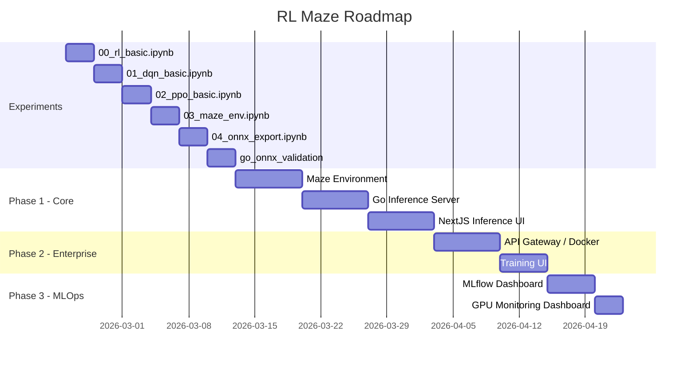

# RL Maze

RL Maze is a minimal AI inference platform demo that shows how to take reinforcement learning from experimentation to production.

- Reinforcement Learning (PPO / DQN)
- ONNX model export
- Go-based inference backend
- Real-time visualization (Next.js + WebSocket)
- MLOps-ready architecture

This project focuses on bridging the gap between PoC and production AI systems.

---

This repository bridges the gap between academic experimentation and real-world AI systems.

このリポジトリは、  
学術的な実験と現実のAIシステムの間にあるギャップを埋めることを目的としています。

---

RL Maze は、強化学習（RL）を使った単なるデモではなく、  
**「AI PoC を動くプロトタイプで終わらせず、本番運用に接続するための最小構成」** を示す個人R&Dポートフォリオです。

実験（Notebook）→ 学習 → ONNX変換 → Go推論サーバー → リアルタイム可視化までを一貫して構成し、  
AI開発における *研究とプロダクトの断絶* を埋めることを目的としています。

---

## What this project demonstrates

- Experiment-to-production workflow for Reinforcement Learning
- Lightweight inference using Go + ONNX
- Real-time agent visualization via WebSocket
- Production-oriented design (health checks, logging, OpenAPI, Docker)
- Cost-aware AI system architecture (rate limiting, GPU usage, scalability)

---

## このプロジェクトで示していること

- RL実験からプロダクションまでの一貫した開発フロー
- Go + ONNXによる軽量推論基盤
- WebSocketを使ったリアルタイム可視化
- 運用前提の設計（ヘルスチェック・ログ・OpenAPI・Docker）
- 将来のSaaS化やGPU運用を見据えたコスト設計

---

## Roadmap

---

📄 設計思想・ビジネス価値・アーキテクチャの詳細はこちら  
👉 [docs/architecture.md](docs/architecture.md)

📓 実験ノート・Notebookの実行手順はこちら  
👉 [experiments/README.md](experiments/README.md)

---

## Quick Start

> 🚧 Currently under construction. Each service will be available progressively.

Please refer to each service README for detailed setup instructions.

- Frontend: `frontend/README.md`
- Inference Server: `backend/inference/README.md`
- Training Service: `backend/training/README.md`
